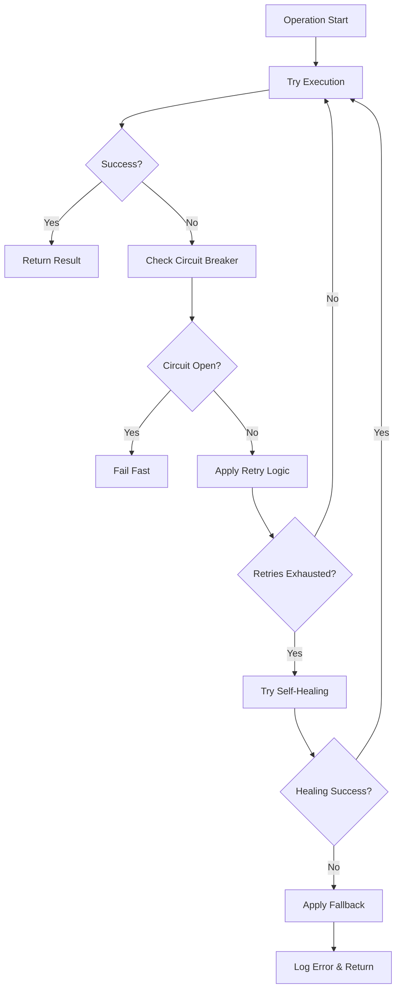

# Error Handling & Troubleshooting Guide

This guide covers Saplings' comprehensive error handling mechanisms, common issues, and troubleshooting strategies to help you build robust applications.

## Table of Contents

- [Error Handling Architecture](#error-handling-architecture)
- [Exception Hierarchy](#exception-hierarchy)
- [Resilience Patterns](#resilience-patterns)
- [Self-Healing Capabilities](#self-healing-capabilities)
- [Common Error Scenarios](#common-error-scenarios)
- [Debugging Strategies](#debugging-strategies)
- [Best Practices](#best-practices)
- [Recovery Mechanisms](#recovery-mechanisms)

## Error Handling Architecture

Saplings implements a multi-layered error handling system designed for production resilience:

### Core Principles

1. **Graceful Degradation**: Operations continue with reduced functionality when possible
2. **Circuit Breaker Pattern**: Prevents cascading failures across services
3. **Automatic Recovery**: Self-healing mechanisms attempt to resolve issues
4. **Comprehensive Logging**: Detailed error information for debugging
5. **Timeout Management**: Prevents hanging operations

### Error Flow



## Exception Hierarchy

### Core Exceptions

```python
from saplings.core.exceptions import (
    # Base exceptions
    SaplingsError,           # Base for all Saplings exceptions
    ConfigurationError,      # Configuration-related errors
    InitializationError,     # Service initialization failures
    
    # Operation exceptions
    OperationError,          # General operation failures
    OperationTimeoutError,   # Timeout-related failures
    OperationCancelledError, # Cancelled operations
    
    # Service-specific exceptions
    ExecutionError,          # LLM execution failures
    ValidationError,         # Output validation failures
    RetrievalError,          # Document retrieval failures
    SelfHealingError,        # Self-healing process failures
    
    # Resilience exceptions
    CircuitBreakerError,     # Circuit breaker triggered
    RetryError,              # Retry mechanism failures
)
```

### Exception Usage Examples

```python
import asyncio
from saplings import AgentBuilder
from saplings.core.exceptions import (
    CircuitBreakerError,
    OperationTimeoutError,
    SelfHealingError
)

async def robust_agent_execution():
    agent = AgentBuilder.for_openai("gpt-4o") \
        .with_self_healing_enabled(True) \
        .with_monitoring_enabled(True) \
        .build()
    
    try:
        result = await agent.run("Analyze this complex dataset", timeout=300)
        return result
    
    except CircuitBreakerError as e:
        print(f"Service temporarily unavailable: {e}")
        print(f"Will retry in {e.recovery_time} seconds")
        await asyncio.sleep(e.recovery_time)
        # Implement retry logic
        
    except OperationTimeoutError as e:
        print(f"Operation timed out: {e}")
        # Try with simpler request or increased timeout
        
    except SelfHealingError as e:
        print(f"Self-healing failed: {e}")
        # Fall back to manual intervention
        
    except Exception as e:
        print(f"Unexpected error: {e}")
        # Log for debugging and apply general fallback
```

## Resilience Patterns

### Circuit Breaker

Prevents cascading failures by temporarily stopping calls to failing services:

```python
from saplings.core.resilience import CircuitBreaker

# Configure circuit breaker
circuit_breaker = CircuitBreaker(
    failure_threshold=5,      # Open after 5 failures
    recovery_timeout=60.0,    # Wait 60 seconds before retry
    expected_exceptions=[     # Exceptions that count as failures
        ExecutionError,
        RetrievalError,
    ]
)

async def protected_operation():
    try:
        return await circuit_breaker.execute(
            your_risky_operation, 
            arg1="value1", 
            arg2="value2"
        )
    except CircuitBreakerError as e:
        print(f"Circuit breaker open: {e.message}")
        print(f"Failure count: {e.failure_count}")
        print(f"Recovery time: {e.recovery_time}s")
        # Implement fallback behavior
```

### Retry Logic with Exponential Backoff

```python
from saplings.core.resilience import retry

@retry(
    max_attempts=3,
    base_delay=1.0,
    max_delay=60.0,
    exponential_base=2.0,
    exceptions=(ExecutionError, RetrievalError)
)
async def reliable_execution():
    agent = AgentBuilder.standard("openai", "gpt-4o").build()
    return await agent.run("Your task here")

# Usage
try:
    result = await reliable_execution()
except RetryError as e:
    print(f"All retry attempts failed: {e}")
    print(f"Original error: {e.last_exception}")
```

### Timeout Management

Configure timeouts at multiple levels:

```python
from saplings import AgentBuilder

# Global timeout configuration
agent = AgentBuilder.for_openai("gpt-4o") \
    .with_model_parameters({
        "request_timeout": 30.0,      # Individual API calls
        "total_timeout": 300.0,       # Total operation time
    }) \
    .build()

# Per-operation timeouts
try:
    # Short timeout for simple tasks
    quick_result = await agent.run(
        "What is 2+2?", 
        timeout=5.0
    )
    
    # Longer timeout for complex analysis
    analysis_result = await agent.run(
        "Analyze this 100-page document", 
        timeout=600.0
    )
    
except OperationTimeoutError as e:
    print(f"Operation timed out: {e}")
    # Implement timeout handling strategy
```

## Self-Healing Capabilities

Saplings can automatically detect and fix certain types of errors:

### Enabling Self-Healing

```python
from saplings import AgentBuilder

agent = AgentBuilder.for_openai("gpt-4o") \
    .with_self_healing_enabled(True) \
    .with_self_healing_max_retries(3) \
    .build()

# Self-healing happens automatically during execution
result = await agent.run("Your task here")
```

### Manual Healing Operations

```python
from saplings.services import SelfHealingService

# Get healing service from agent
healing_service = agent._facade.self_healing_service

# Generate patch for known failure
patch_result = await healing_service.generate_patch(
    failure_input="Original failing input",
    failure_output="Error output received",
    desired_output="Expected correct output"
)

if patch_result["success"]:
    # Apply the patch
    applied = await healing_service.apply_patch(patch_result["patch_id"])
    print(f"Patch applied: {applied}")
else:
    print(f"Patch generation failed: {patch_result.get('error')}")

# List available recovery adapters
adapters = await healing_service.list_adapters()
print(f"Available adapters: {adapters}")
```

### Healing Configuration

```python
from saplings.api.services import SelfHealingConfig

config = SelfHealingConfig(
    enabled=True,
    max_retries=5,
    auto_apply_patches=True,          # Automatically apply fixes
    patch_validation=True,            # Validate patches before applying
    learning_enabled=True,            # Learn from successful fixes
    success_pair_collection=True,     # Collect success patterns
)

agent = AgentBuilder.for_openai("gpt-4o") \
    .with_self_healing_config(config) \
    .build()
```

## Common Error Scenarios

### 1. API Rate Limiting

**Problem**: OpenAI/Anthropic API rate limits exceeded
**Symptoms**: `RateLimitError` or HTTP 429 responses

```python
from saplings.core.exceptions import RateLimitError
import asyncio

async def handle_rate_limiting():
    agent = AgentBuilder.for_openai("gpt-4o") \
        .with_model_parameters({
            "rate_limit_retry": True,
            "max_retries": 5,
            "retry_delay": 1.0,
        }) \
        .build()
    
    try:
        result = await agent.run("Your task")
    except RateLimitError as e:
        print(f"Rate limited: {e}")
        # Wait and retry
        await asyncio.sleep(e.retry_after or 60)
        result = await agent.run("Your task")
```

### 2. Memory Exhaustion

**Problem**: Large document collections exceed memory limits
**Symptoms**: `MemoryError` or performance degradation

```python
# Solution: Use chunking and streaming
agent = AgentBuilder.for_openai("gpt-4o") \
    .with_memory_path("./agent_memory") \
    .with_retrieval_max_documents(10) \
    .with_gasa_enabled(True) \
    .build()

# Process documents in batches
async def process_large_dataset(documents):
    batch_size = 50
    results = []
    
    for i in range(0, len(documents), batch_size):
        batch = documents[i:i + batch_size]
        
        # Clear memory between batches
        agent.clear_memory()
        
        # Add current batch
        for doc in batch:
            agent.add_document(doc)
        
        # Process batch
        result = await agent.run("Analyze these documents")
        results.append(result)
    
    return results
```

### 3. Tool Execution Failures

**Problem**: Tools fail due to missing dependencies or permissions
**Symptoms**: `ToolExecutionError` or import failures

```python
from saplings.tools.exceptions import ToolExecutionError

try:
    agent = AgentBuilder.for_openai("gpt-4o") \
        .with_tools(["PythonInterpreterTool"]) \
        .with_tool_factory_enabled(True) \
        .with_tool_factory_sandbox_enabled(True) \
        .build()
    
    result = await agent.run("Create a visualization of this data")
    
except ToolExecutionError as e:
    print(f"Tool execution failed: {e}")
    print(f"Tool: {e.tool_name}")
    print(f"Error details: {e.details}")
    
    # Fallback to simpler approach
    agent_no_tools = AgentBuilder.for_openai("gpt-4o").build()
    result = await agent_no_tools.run("Describe how to visualize this data")
```

### 4. GASA Performance Issues

**Problem**: Graph-Aligned Sparse Attention causing slowdowns
**Symptoms**: High memory usage or slow response times

```python
# Optimize GASA configuration
agent = AgentBuilder.for_openai("gpt-4o") \
    .with_gasa_enabled(True) \
    .with_gasa_max_hops(1) \
    .with_gasa_strategy("binary") \
    .with_gasa_fallback("block_diagonal") \
    .with_gasa_cache_enabled(True) \
    .build()

# Monitor performance
import time

start_time = time.time()
result = await agent.run("Your task")
end_time = time.time()

print(f"Execution time: {end_time - start_time:.2f}s")

# If too slow, disable GASA for simpler tasks
if end_time - start_time > 30:
    agent_simple = AgentBuilder.for_openai("gpt-4o") \
        .with_gasa_enabled(False) \
        .build()
```

### 5. Configuration Errors

**Problem**: Invalid or conflicting configuration settings
**Symptoms**: `ConfigurationError` on agent creation

```python
from saplings.core.exceptions import ConfigurationError

try:
    # Invalid configuration
    agent = AgentBuilder() \
        .with_provider("invalid_provider") \
        .with_model_name("nonexistent-model") \
        .build()
        
except ConfigurationError as e:
    print(f"Configuration error: {e}")
    
    # Use working configuration
    agent = AgentBuilder.standard("openai", "gpt-4o") \
        .with_api_key("your-key") \
        .build()
```

## Debugging Strategies

### 1. Enable Comprehensive Logging

```python
import logging

# Configure logging
logging.basicConfig(
    level=logging.DEBUG,
    format='%(asctime)s - %(name)s - %(levelname)s - %(message)s',
    handlers=[
        logging.FileHandler('saplings.log'),
        logging.StreamHandler()
    ]
)

# Enable specific loggers
logging.getLogger('saplings.executor').setLevel(logging.DEBUG)
logging.getLogger('saplings.tools').setLevel(logging.DEBUG)
logging.getLogger('saplings.memory').setLevel(logging.DEBUG)
```

### 2. Use Monitoring and Tracing

```python
from saplings import AgentBuilder

agent = AgentBuilder.for_openai("gpt-4o") \
    .with_monitoring_enabled(True) \
    .build()

# Get monitoring service
monitoring = agent._facade.monitoring_service

# Create trace for debugging
trace = monitoring.create_trace()

# Add custom events
monitoring.log_event(
    "debug_checkpoint",
    {"step": "before_execution", "input_length": len(prompt)},
    trace_id=trace.trace_id
)

result = await agent.run("Your task", trace_id=trace.trace_id)

# Analyze trace
traces = monitoring.get_traces()
for trace in traces:
    print(f"Trace {trace.trace_id}: {len(trace.spans)} spans")
    for span in trace.spans:
        print(f"  {span.name}: {span.duration}ms")
```

### 3. Validate Inputs and Outputs

```python
from saplings.core.validation import validate_input, validate_output

# Input validation
def validate_task_input(task: str) -> bool:
    if not task or len(task.strip()) == 0:
        raise ValueError("Task cannot be empty")
    
    if len(task) > 10000:
        raise ValueError("Task too long (max 10000 characters)")
    
    return True

# Output validation
def validate_response(response: str) -> bool:
    if not response:
        raise ValueError("Empty response received")
    
    # Check for error indicators
    error_indicators = ["error:", "failed:", "exception:"]
    if any(indicator in response.lower() for indicator in error_indicators):
        raise ValueError(f"Error detected in response: {response[:100]}")
    
    return True

# Use validation
try:
    validate_task_input(task)
    result = await agent.run(task)
    validate_response(result)
except ValueError as e:
    print(f"Validation failed: {e}")
```

### 4. Test with Minimal Configuration

```python
# Start with minimal configuration for debugging
debug_agent = AgentBuilder.minimal("openai", "gpt-4o") \
    .with_api_key("your-key") \
    .with_monitoring_enabled(True) \
    .build()

# Test basic functionality
try:
    simple_result = await debug_agent.run("Hello, world!")
    print("Basic functionality working")
except Exception as e:
    print(f"Basic functionality failed: {e}")

# Gradually add features
if simple_result:
    # Add tools
    debug_agent_with_tools = AgentBuilder.minimal("openai", "gpt-4o") \
        .with_tools(["PythonInterpreterTool"]) \
        .build()
    
    try:
        tool_result = await debug_agent_with_tools.run("Calculate 2+2")
        print("Tools working")
    except Exception as e:
        print(f"Tools failed: {e}")
```

## Best Practices

### 1. Implement Proper Error Boundaries

```python
class ErrorBoundary:
    """Context manager for handling errors gracefully."""
    
    def __init__(self, fallback_result=None, log_errors=True):
        self.fallback_result = fallback_result
        self.log_errors = log_errors
    
    async def __aenter__(self):
        return self
    
    async def __aexit__(self, exc_type, exc_val, exc_tb):
        if exc_type is not None and self.log_errors:
            logging.error(f"Error in boundary: {exc_val}")
        
        # Suppress exception if fallback is provided
        return self.fallback_result is not None

# Usage
async def safe_agent_execution():
    async with ErrorBoundary(fallback_result="Operation failed, please try again"):
        agent = AgentBuilder.for_openai("gpt-4o").build()
        return await agent.run("Complex task")
```

### 2. Use Health Checks

```python
async def check_agent_health(agent):
    """Perform health checks on an agent."""
    health_status = {
        "api_connection": False,
        "memory_accessible": False,
        "tools_available": False,
        "overall_healthy": False
    }
    
    try:
        # Test API connection
        simple_result = await agent.run("Hello", timeout=10)
        health_status["api_connection"] = True
        
        # Test memory
        agent.add_document("Test document", {"test": True})
        health_status["memory_accessible"] = True
        
        # Test tools (if enabled)
        if hasattr(agent, 'tools') and agent.tools:
            tool_result = await agent.run("What tools do you have?", timeout=10)
            health_status["tools_available"] = True
        else:
            health_status["tools_available"] = True  # No tools configured
        
        health_status["overall_healthy"] = all([
            health_status["api_connection"],
            health_status["memory_accessible"],
            health_status["tools_available"]
        ])
        
    except Exception as e:
        logging.error(f"Health check failed: {e}")
    
    return health_status

# Use health checks
health = await check_agent_health(agent)
if not health["overall_healthy"]:
    print("Agent not healthy, investigating...")
    for component, status in health.items():
        if not status:
            print(f"Issue with: {component}")
```

### 3. Implement Graceful Shutdown

```python
import signal
import asyncio

class GracefulAgentManager:
    def __init__(self):
        self.agents = []
        self.shutdown_event = asyncio.Event()
    
    def add_agent(self, agent):
        self.agents.append(agent)
    
    async def shutdown_handler(self, signum, frame):
        """Handle shutdown signals gracefully."""
        print(f"Received signal {signum}, shutting down gracefully...")
        
        # Cancel ongoing operations
        for agent in self.agents:
            if hasattr(agent, 'cancel_operations'):
                await agent.cancel_operations()
        
        # Clean up resources
        for agent in self.agents:
            if hasattr(agent, 'cleanup'):
                await agent.cleanup()
        
        self.shutdown_event.set()
    
    def setup_signal_handlers(self):
        signal.signal(signal.SIGINT, self.shutdown_handler)
        signal.signal(signal.SIGTERM, self.shutdown_handler)

# Usage
manager = GracefulAgentManager()
manager.setup_signal_handlers()

agent = AgentBuilder.for_openai("gpt-4o").build()
manager.add_agent(agent)

# Your application logic here
# ...

# Wait for shutdown
await manager.shutdown_event.wait()
```

## Recovery Mechanisms

### 1. State Recovery

```python
import json
import os

class StateManager:
    """Manage agent state for recovery."""
    
    def __init__(self, state_file="agent_state.json"):
        self.state_file = state_file
    
    def save_state(self, agent, operation_context):
        """Save current agent state."""
        state = {
            "timestamp": time.time(),
            "configuration": agent.config.__dict__,
            "memory_path": getattr(agent.config, 'memory_path', None),
            "operation_context": operation_context
        }
        
        with open(self.state_file, 'w') as f:
            json.dump(state, f, indent=2)
    
    def load_state(self):
        """Load previous agent state."""
        if not os.path.exists(self.state_file):
            return None
        
        with open(self.state_file, 'r') as f:
            return json.load(f)
    
    def recover_agent(self):
        """Recover agent from saved state."""
        state = self.load_state()
        if not state:
            return None
        
        # Rebuild agent from saved configuration
        agent = AgentBuilder.from_dict(state["configuration"]).build()
        
        # Restore memory if available
        if state.get("memory_path") and os.path.exists(state["memory_path"]):
            agent.load_memory(state["memory_path"])
        
        return agent, state.get("operation_context")

# Usage
state_manager = StateManager()

try:
    # Save state before critical operations
    state_manager.save_state(agent, {"task": "important_task"})
    
    result = await agent.run("Important task")
    
except Exception as e:
    print(f"Operation failed: {e}")
    
    # Attempt recovery
    recovered_agent, context = state_manager.recover_agent()
    if recovered_agent:
        print("Agent recovered, retrying...")
        result = await recovered_agent.run(context["task"])
```

### 2. Checkpoint and Resume

```python
class CheckpointManager:
    """Manage operation checkpoints for long-running tasks."""
    
    def __init__(self, checkpoint_dir="checkpoints"):
        self.checkpoint_dir = checkpoint_dir
        os.makedirs(checkpoint_dir, exist_ok=True)
    
    def save_checkpoint(self, task_id, step, data):
        """Save a checkpoint."""
        checkpoint_file = os.path.join(self.checkpoint_dir, f"{task_id}_{step}.json")
        with open(checkpoint_file, 'w') as f:
            json.dump(data, f, indent=2)
    
    def load_checkpoint(self, task_id, step):
        """Load a checkpoint."""
        checkpoint_file = os.path.join(self.checkpoint_dir, f"{task_id}_{step}.json")
        if os.path.exists(checkpoint_file):
            with open(checkpoint_file, 'r') as f:
                return json.load(f)
        return None
    
    def get_latest_checkpoint(self, task_id):
        """Get the latest checkpoint for a task."""
        checkpoints = []
        for filename in os.listdir(self.checkpoint_dir):
            if filename.startswith(f"{task_id}_"):
                step = int(filename.split("_")[1].split(".")[0])
                checkpoints.append(step)
        
        if checkpoints:
            return max(checkpoints)
        return None

# Usage for long-running tasks
async def resumable_long_task(task_id, steps):
    checkpoint_manager = CheckpointManager()
    
    # Check for existing checkpoint
    latest_step = checkpoint_manager.get_latest_checkpoint(task_id)
    start_step = latest_step + 1 if latest_step is not None else 0
    
    print(f"Starting from step {start_step}")
    
    for step in range(start_step, len(steps)):
        try:
            # Execute step
            result = await agent.run(steps[step])
            
            # Save checkpoint
            checkpoint_manager.save_checkpoint(
                task_id, 
                step, 
                {"step": step, "result": result, "completed": True}
            )
            
        except Exception as e:
            print(f"Step {step} failed: {e}")
            # Save failed checkpoint for debugging
            checkpoint_manager.save_checkpoint(
                task_id, 
                step, 
                {"step": step, "error": str(e), "completed": False}
            )
            break
```

This comprehensive error handling guide provides users with the knowledge and tools needed to build robust, production-ready applications with Saplings' error handling infrastructure.