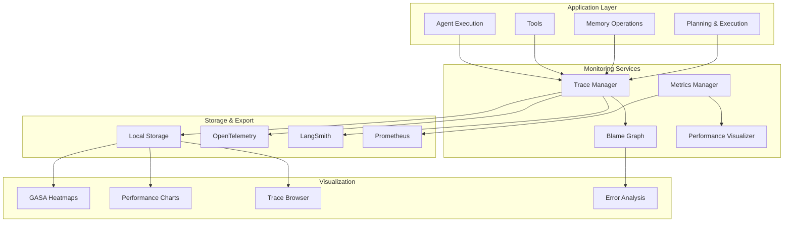

# Monitoring & Observability Guide

This guide covers Saplings' comprehensive monitoring and observability features, including distributed tracing, performance monitoring, error tracking, and visualization capabilities.

## Table of Contents

- [Monitoring Architecture](#monitoring-architecture)
- [Distributed Tracing](#distributed-tracing)
- [Performance Monitoring](#performance-monitoring)
- [Error Tracking & Analysis](#error-tracking--analysis)
- [Metrics Collection](#metrics-collection)
- [Visualization & Dashboards](#visualization--dashboards)
- [Integration with External Systems](#integration-with-external-systems)
- [Custom Monitoring](#custom-monitoring)
- [Production Monitoring](#production-monitoring)
- [Troubleshooting with Monitoring](#troubleshooting-with-monitoring)

## Monitoring Architecture

### Overview

Saplings provides a multi-layered monitoring system designed for production observability:



### Core Components

| Component | Purpose | Data Type | Export Options |
|-----------|---------|-----------|----------------|
| **Trace Manager** | Distributed tracing | Spans, traces | OpenTelemetry, LangSmith |
| **Metrics Manager** | Performance metrics | Counters, gauges | Prometheus, JSON |
| **Blame Graph** | Error analysis | Causality chains | HTML, JSON |
| **Performance Visualizer** | Performance insights | Charts, graphs | HTML, PNG |

## Distributed Tracing

### Basic Tracing Setup

```python
from saplings import AgentBuilder
from saplings.monitoring import MonitoringConfig, TracingBackend

# Configure monitoring
monitoring_config = MonitoringConfig(
    enabled=True,
    tracing_backend=TracingBackend.CONSOLE,  # or OTEL, LANGSMITH
    trace_sampling_rate=1.0,  # Sample all traces
    enable_blame_graph=True,
    enable_gasa_heatmap=True,
)

# Create agent with monitoring
agent = AgentBuilder.for_openai("gpt-4o") \
    .with_monitoring_enabled(True) \
    .with_monitoring_config(monitoring_config) \
    .build()

# All operations are automatically traced
result = await agent.run("Analyze this data")
```

### Manual Trace Creation

```python
# Get monitoring service
monitoring = agent._facade.monitoring_service

# Create custom trace
trace = monitoring.create_trace()
print(f"Created trace: {trace.trace_id}")

# Create spans for custom operations
span = monitoring.start_span(
    name="custom_analysis",
    trace_id=trace.trace_id,
    attributes={
        "operation_type": "data_analysis",
        "input_size": len(data),
        "user_id": "user123"
    }
)

try:
    # Your custom operation
    result = await perform_analysis(data)
    
    # Add success attributes
    monitoring.add_span_attribute(span.span_id, "result_count", len(result))
    monitoring.add_span_attribute(span.span_id, "status", "success")
    
except Exception as e:
    # Record error
    monitoring.add_span_attribute(span.span_id, "error", str(e))
    monitoring.add_span_attribute(span.span_id, "status", "error")
    raise
    
finally:
    # End span
    monitoring.end_span(span.span_id)
```

### Trace Context Propagation

```python
import asyncio
from contextvars import ContextVar

# Context variable for trace ID
trace_context: ContextVar[str] = ContextVar('trace_id', default=None)

async def traced_operation(data, trace_id=None):
    """Operation that propagates trace context."""
    
    # Set trace context
    if trace_id:
        trace_context.set(trace_id)
    
    # Get current trace ID
    current_trace_id = trace_context.get()
    
    # Create span with context
    span = monitoring.start_span(
        name="traced_operation",
        trace_id=current_trace_id,
        attributes={"operation": "data_processing"}
    )
    
    try:
        # Nested operation inherits context
        result = await nested_operation(data)
        return result
    finally:
        monitoring.end_span(span.span_id)

async def nested_operation(data):
    """Nested operation that inherits trace context."""
    
    # Automatically uses parent trace context
    current_trace_id = trace_context.get()
    
    span = monitoring.start_span(
        name="nested_operation",
        trace_id=current_trace_id,
        attributes={"nested": True}
    )
    
    try:
        # Process data
        await asyncio.sleep(0.1)  # Simulate processing
        return {"processed": len(data)}
    finally:
        monitoring.end_span(span.span_id)

# Usage
trace = monitoring.create_trace()
result = await traced_operation(data, trace_id=trace.trace_id)
```

### OpenTelemetry Integration

```python
from saplings.monitoring import MonitoringConfig, TracingBackend

# Configure OpenTelemetry export
monitoring_config = MonitoringConfig(
    enabled=True,
    tracing_backend=TracingBackend.OTEL,
    otel_endpoint="http://jaeger:14268/api/traces",  # Jaeger endpoint
    trace_sampling_rate=0.1,  # Sample 10% for production
)

agent = AgentBuilder.for_openai("gpt-4o") \
    .with_monitoring_config(monitoring_config) \
    .build()

# Traces are automatically exported to OpenTelemetry
result = await agent.run("Your task")
```

### LangSmith Integration

```python
import os
from saplings.monitoring import MonitoringConfig, TracingBackend

# Configure LangSmith
monitoring_config = MonitoringConfig(
    enabled=True,
    tracing_backend=TracingBackend.LANGSMITH,
    langsmith_api_key=os.getenv("LANGSMITH_API_KEY"),
    langsmith_project="saplings-production",
)

agent = AgentBuilder.for_openai("gpt-4o") \
    .with_monitoring_config(monitoring_config) \
    .build()

# Automatically tracked in LangSmith
result = await agent.run("Analyze customer feedback")
```

## Performance Monitoring

### Built-in Performance Metrics

```python
from saplings.monitoring import PerformanceMonitor

# Create performance monitor
perf_monitor = PerformanceMonitor(agent)

# Monitor execution performance
async def monitored_execution():
    with perf_monitor.measure("agent_execution"):
        result = await agent.run("Complex analysis task")
    
    # Get performance stats
    stats = perf_monitor.get_stats()
    print(f"Execution time: {stats['agent_execution']['mean']:.2f}s")
    print(f"Memory usage: {stats['memory_usage_mb']:.1f}MB")
    
    return result

# Run with monitoring
result = await monitored_execution()
```

### Custom Performance Tracking

```python
import time
import psutil
from typing import Dict, Any

class CustomPerformanceTracker:
    """Track custom performance metrics."""
    
    def __init__(self):
        self.metrics = {}
        self.start_times = {}
    
    def start_timer(self, operation: str):
        """Start timing an operation."""
        self.start_times[operation] = time.time()
    
    def end_timer(self, operation: str) -> float:
        """End timing and record duration."""
        if operation not in self.start_times:
            return 0.0
        
        duration = time.time() - self.start_times[operation]
        
        if operation not in self.metrics:
            self.metrics[operation] = []
        
        self.metrics[operation].append(duration)
        del self.start_times[operation]
        
        return duration
    
    def record_memory_usage(self):
        """Record current memory usage."""
        process = psutil.Process()
        memory_mb = process.memory_info().rss / 1024 / 1024
        
        if 'memory_usage' not in self.metrics:
            self.metrics['memory_usage'] = []
        
        self.metrics['memory_usage'].append(memory_mb)
        return memory_mb
    
    def get_summary(self) -> Dict[str, Any]:
        """Get performance summary."""
        summary = {}
        
        for operation, times in self.metrics.items():
            if times:
                summary[operation] = {
                    'count': len(times),
                    'mean': sum(times) / len(times),
                    'min': min(times),
                    'max': max(times),
                    'total': sum(times)
                }
        
        return summary

# Usage
tracker = CustomPerformanceTracker()

async def tracked_execution():
    tracker.start_timer("full_execution")
    tracker.record_memory_usage()
    
    # Track specific operations
    tracker.start_timer("document_retrieval")
    documents = await agent.retrieve_documents("query")
    retrieval_time = tracker.end_timer("document_retrieval")
    
    tracker.start_timer("llm_generation")
    result = await agent.run("Analyze documents")
    generation_time = tracker.end_timer("llm_generation")
    
    tracker.end_timer("full_execution")
    tracker.record_memory_usage()
    
    # Get performance summary
    summary = tracker.get_summary()
    print("Performance Summary:")
    for operation, stats in summary.items():
        print(f"  {operation}: {stats['mean']:.2f}s avg, {stats['count']} calls")
    
    return result
```

### GASA Performance Monitoring

```python
from saplings.monitoring import GASAPerformanceMonitor

# Monitor GASA performance
gasa_monitor = GASAPerformanceMonitor()

agent = AgentBuilder.for_openai("gpt-4o") \
    .with_gasa_enabled(True) \
    .with_gasa_performance_monitor(gasa_monitor) \
    .build()

# Execute with GASA monitoring
result = await agent.run("Analyze documents with GASA")

# Get GASA performance metrics
gasa_stats = gasa_monitor.get_stats()
print(f"GASA attention hops: {gasa_stats['avg_hops']:.1f}")
print(f"GASA efficiency: {gasa_stats['efficiency']:.2%}")
print(f"Fallback usage: {gasa_stats['fallback_rate']:.2%}")

# Generate GASA heatmap
heatmap = gasa_monitor.generate_heatmap()
heatmap.save("gasa_performance.html")
```

## Error Tracking & Analysis

### Blame Graph Analysis

```python
from saplings.monitoring import BlameGraph

# Get blame graph from monitoring service
blame_graph = monitoring.blame_graph

# Add execution trace
trace_id = "trace_123"
blame_graph.add_execution_trace(
    trace_id=trace_id,
    component="llm_execution",
    inputs={"prompt": "Analyze data"},
    outputs={"result": "Analysis complete"},
    success=True,
    execution_time=2.5
)

# Add error trace
error_trace_id = "trace_124"
blame_graph.add_execution_trace(
    trace_id=error_trace_id,
    component="document_retrieval",
    inputs={"query": "complex query"},
    outputs={"error": "Timeout"},
    success=False,
    execution_time=30.0,
    error_type="TimeoutError"
)

# Analyze error patterns
error_analysis = blame_graph.analyze_errors()
print("Error Analysis:")
for component, analysis in error_analysis.items():
    print(f"  {component}:")
    print(f"    Error rate: {analysis['error_rate']:.2%}")
    print(f"    Common errors: {analysis['common_errors']}")
    print(f"    Avg failure time: {analysis['avg_failure_time']:.1f}s")

# Identify bottlenecks
bottlenecks = blame_graph.identify_bottlenecks(
    threshold_ms=1000,  # Operations taking >1s
    min_call_count=5    # With at least 5 calls
)

print("Performance Bottlenecks:")
for bottleneck in bottlenecks:
    print(f"  {bottleneck['component']}: {bottleneck['avg_time']:.1f}s avg")
```

### Error Source Identification

```python
# Identify error sources automatically
error_sources = monitoring.identify_error_sources(
    min_error_rate=0.1,  # 10% error rate threshold
    min_call_count=10    # At least 10 calls
)

print("Identified Error Sources:")
for source in error_sources:
    print(f"Component: {source['component']}")
    print(f"Error Rate: {source['error_rate']:.2%}")
    print(f"Total Calls: {source['call_count']}")
    print(f"Common Errors: {source['error_types']}")
    print(f"Recommendation: {source['recommendation']}")
    print("---")
```

### Real-time Error Alerting

```python
import asyncio
from typing import Callable

class ErrorAlerting:
    """Real-time error alerting system."""
    
    def __init__(self, monitoring_service):
        self.monitoring = monitoring_service
        self.alert_handlers = []
        self.error_thresholds = {
            'error_rate': 0.05,  # 5% error rate
            'response_time': 10.0,  # 10 second response time
            'memory_usage': 0.8,  # 80% memory usage
        }
    
    def add_alert_handler(self, handler: Callable):
        """Add custom alert handler."""
        self.alert_handlers.append(handler)
    
    async def monitor_continuously(self):
        """Monitor for error conditions continuously."""
        while True:
            try:
                # Check error rates
                error_rate = self.monitoring.get_current_error_rate()
                if error_rate > self.error_thresholds['error_rate']:
                    await self.trigger_alert(
                        "HIGH_ERROR_RATE",
                        f"Error rate {error_rate:.2%} exceeds threshold"
                    )
                
                # Check response times
                avg_response_time = self.monitoring.get_avg_response_time()
                if avg_response_time > self.error_thresholds['response_time']:
                    await self.trigger_alert(
                        "HIGH_RESPONSE_TIME",
                        f"Response time {avg_response_time:.1f}s exceeds threshold"
                    )
                
                # Check memory usage
                memory_usage = self.monitoring.get_memory_usage_ratio()
                if memory_usage > self.error_thresholds['memory_usage']:
                    await self.trigger_alert(
                        "HIGH_MEMORY_USAGE",
                        f"Memory usage {memory_usage:.1%} exceeds threshold"
                    )
                
            except Exception as e:
                print(f"Error in monitoring: {e}")
            
            await asyncio.sleep(30)  # Check every 30 seconds
    
    async def trigger_alert(self, alert_type: str, message: str):
        """Trigger alert to all handlers."""
        alert_data = {
            'type': alert_type,
            'message': message,
            'timestamp': time.time(),
            'severity': self.get_severity(alert_type)
        }
        
        for handler in self.alert_handlers:
            try:
                await handler(alert_data)
            except Exception as e:
                print(f"Error in alert handler: {e}")
    
    def get_severity(self, alert_type: str) -> str:
        """Get alert severity level."""
        severity_map = {
            'HIGH_ERROR_RATE': 'critical',
            'HIGH_RESPONSE_TIME': 'warning',
            'HIGH_MEMORY_USAGE': 'warning',
        }
        return severity_map.get(alert_type, 'info')

# Alert handlers
async def slack_alert_handler(alert):
    """Send alert to Slack."""
    # Implementation would use Slack API
    print(f"SLACK ALERT: {alert['type']} - {alert['message']}")

async def email_alert_handler(alert):
    """Send alert via email."""
    # Implementation would use email service
    print(f"EMAIL ALERT: {alert['type']} - {alert['message']}")

# Setup alerting
alerting = ErrorAlerting(monitoring)
alerting.add_alert_handler(slack_alert_handler)
alerting.add_alert_handler(email_alert_handler)

# Start monitoring (run in background)
asyncio.create_task(alerting.monitor_continuously())
```

## Metrics Collection

### Prometheus Integration

```python
from prometheus_client import Counter, Histogram, Gauge, start_http_server
import time

# Define Prometheus metrics
REQUEST_COUNT = Counter(
    'saplings_requests_total',
    'Total agent requests',
    ['agent_type', 'operation', 'status']
)

REQUEST_DURATION = Histogram(
    'saplings_request_duration_seconds',
    'Request duration in seconds',
    ['agent_type', 'operation']
)

MEMORY_USAGE = Gauge(
    'saplings_memory_usage_bytes',
    'Current memory usage in bytes'
)

ACTIVE_AGENTS = Gauge(
    'saplings_active_agents',
    'Number of active agent instances'
)

class PrometheusMetricsCollector:
    """Collect and expose Prometheus metrics."""
    
    def __init__(self, agent):
        self.agent = agent
        self.agent_type = agent.__class__.__name__
    
    async def record_request(self, operation: str, duration: float, status: str):
        """Record request metrics."""
        REQUEST_COUNT.labels(
            agent_type=self.agent_type,
            operation=operation,
            status=status
        ).inc()
        
        REQUEST_DURATION.labels(
            agent_type=self.agent_type,
            operation=operation
        ).observe(duration)
    
    def update_memory_usage(self, bytes_used: int):
        """Update memory usage metric."""
        MEMORY_USAGE.set(bytes_used)
    
    def increment_active_agents(self):
        """Increment active agents counter."""
        ACTIVE_AGENTS.inc()
    
    def decrement_active_agents(self):
        """Decrement active agents counter."""
        ACTIVE_AGENTS.dec()

# Middleware for automatic metrics collection
class MetricsMiddleware:
    """Middleware to automatically collect metrics."""
    
    def __init__(self, metrics_collector):
        self.metrics = metrics_collector
    
    async def __call__(self, operation_name: str, operation_func, *args, **kwargs):
        """Wrap operation with metrics collection."""
        start_time = time.time()
        status = "success"
        
        try:
            result = await operation_func(*args, **kwargs)
            return result
        except Exception as e:
            status = "error"
            raise
        finally:
            duration = time.time() - start_time
            await self.metrics.record_request(operation_name, duration, status)

# Usage
metrics_collector = PrometheusMetricsCollector(agent)
metrics_middleware = MetricsMiddleware(metrics_collector)

# Start Prometheus HTTP server
start_http_server(8001)  # Metrics available at http://localhost:8001/metrics

# Wrap agent operations
async def monitored_run(task):
    return await metrics_middleware(
        "agent_run",
        agent.run,
        task
    )

# Use monitored operations
result = await monitored_run("Analyze data")
```

### Custom Metrics Dashboard

```python
import json
from datetime import datetime, timedelta
from typing import Dict, List, Any

class MetricsDashboard:
    """Custom metrics dashboard for Saplings."""
    
    def __init__(self, monitoring_service):
        self.monitoring = monitoring_service
        self.metrics_history = []
    
    def collect_current_metrics(self) -> Dict[str, Any]:
        """Collect current system metrics."""
        traces = self.monitoring.get_traces()
        
        # Calculate metrics from traces
        total_requests = len(traces)
        successful_requests = sum(1 for trace in traces if trace.status == "OK")
        error_rate = (total_requests - successful_requests) / total_requests if total_requests > 0 else 0
        
        # Calculate average response times
        response_times = []
        for trace in traces:
            if trace.spans:
                total_duration = sum(span.duration for span in trace.spans)
                response_times.append(total_duration)
        
        avg_response_time = sum(response_times) / len(response_times) if response_times else 0
        
        metrics = {
            'timestamp': datetime.now().isoformat(),
            'total_requests': total_requests,
            'successful_requests': successful_requests,
            'error_rate': error_rate,
            'avg_response_time': avg_response_time,
            'active_traces': len([t for t in traces if t.status == "ACTIVE"]),
        }
        
        self.metrics_history.append(metrics)
        
        # Keep only last 100 entries
        if len(self.metrics_history) > 100:
            self.metrics_history = self.metrics_history[-100:]
        
        return metrics
    
    def generate_dashboard_html(self) -> str:
        """Generate HTML dashboard."""
        current_metrics = self.collect_current_metrics()
        
        html = f"""
        <!DOCTYPE html>
        <html>
        <head>
            <title>Saplings Monitoring Dashboard</title>
            <script src="https://cdn.plot.ly/plotly-latest.min.js"></script>
            <style>
                body {{ font-family: Arial, sans-serif; margin: 20px; }}
                .metric-card {{ 
                    border: 1px solid #ddd; 
                    border-radius: 8px; 
                    padding: 20px; 
                    margin: 10px; 
                    display: inline-block; 
                    min-width: 200px;
                }}
                .metric-value {{ font-size: 24px; font-weight: bold; color: #333; }}
                .metric-label {{ font-size: 14px; color: #666; }}
            </style>
        </head>
        <body>
            <h1>Saplings Monitoring Dashboard</h1>
            <div id="metrics-cards">
                <div class="metric-card">
                    <div class="metric-value">{current_metrics['total_requests']}</div>
                    <div class="metric-label">Total Requests</div>
                </div>
                <div class="metric-card">
                    <div class="metric-value">{current_metrics['error_rate']:.2%}</div>
                    <div class="metric-label">Error Rate</div>
                </div>
                <div class="metric-card">
                    <div class="metric-value">{current_metrics['avg_response_time']:.2f}s</div>
                    <div class="metric-label">Avg Response Time</div>
                </div>
            </div>
            <div id="response-time-chart" style="width:100%;height:400px;"></div>
            <div id="error-rate-chart" style="width:100%;height:400px;"></div>
            
            <script>
                // Response time chart
                var responseTimeData = {{
                    x: {json.dumps([m['timestamp'] for m in self.metrics_history])},
                    y: {json.dumps([m['avg_response_time'] for m in self.metrics_history])},
                    type: 'scatter',
                    mode: 'lines+markers',
                    name: 'Response Time'
                }};
                
                Plotly.newPlot('response-time-chart', [responseTimeData], {{
                    title: 'Average Response Time Over Time',
                    xaxis: {{ title: 'Time' }},
                    yaxis: {{ title: 'Response Time (seconds)' }}
                }});
                
                // Error rate chart
                var errorRateData = {{
                    x: {json.dumps([m['timestamp'] for m in self.metrics_history])},
                    y: {json.dumps([m['error_rate'] * 100 for m in self.metrics_history])},
                    type: 'scatter',
                    mode: 'lines+markers',
                    name: 'Error Rate',
                    line: {{ color: 'red' }}
                }};
                
                Plotly.newPlot('error-rate-chart', [errorRateData], {{
                    title: 'Error Rate Over Time',
                    xaxis: {{ title: 'Time' }},
                    yaxis: {{ title: 'Error Rate (%)' }}
                }});
            </script>
        </body>
        </html>
        """
        
        return html
    
    def save_dashboard(self, filename: str = "dashboard.html"):
        """Save dashboard to HTML file."""
        html = self.generate_dashboard_html()
        with open(filename, 'w') as f:
            f.write(html)
        print(f"Dashboard saved to {filename}")

# Usage
dashboard = MetricsDashboard(monitoring)

# Update metrics periodically
async def update_dashboard():
    while True:
        dashboard.collect_current_metrics()
        dashboard.save_dashboard()
        await asyncio.sleep(60)  # Update every minute

# Start dashboard updates
asyncio.create_task(update_dashboard())
```

## Visualization & Dashboards

### GASA Heatmap Visualization

```python
from saplings.monitoring import GASAHeatmap

# Create GASA heatmap
gasa_heatmap = GASAHeatmap(monitoring)

# Generate heatmap for specific trace
trace_id = "trace_123"
heatmap = gasa_heatmap.create_heatmap(
    trace_id=trace_id,
    title="GASA Attention Patterns",
    show_tokens=True,
    show_attention_weights=True
)

# Save as interactive HTML
heatmap.save("gasa_attention.html")

# Save as static image
heatmap.save_png("gasa_attention.png", width=1200, height=800)

# Create animated heatmap for multiple hops
animated_heatmap = gasa_heatmap.create_animated_heatmap(
    trace_id=trace_id,
    max_hops=3
)
animated_heatmap.save("gasa_animation.html")
```

### Performance Visualization

```python
from saplings.monitoring import PerformanceVisualizer

# Create performance visualizer
perf_viz = PerformanceVisualizer(monitoring)

# Generate latency visualization
latency_data = {
    'llm_execution': [1.2, 1.5, 1.8, 1.1, 2.0],
    'document_retrieval': [0.3, 0.4, 0.2, 0.5, 0.3],
    'memory_operations': [0.1, 0.2, 0.1, 0.1, 0.2]
}

latency_chart = perf_viz.visualize_latency(
    latencies=latency_data,
    title="Component Latency Distribution",
    output_path="latency_chart.html"
)

# Generate throughput visualization
throughput_data = {
    'total_requests': [100, 120, 110, 130, 125],
    'successful_requests': [95, 115, 105, 125, 120],
    'failed_requests': [5, 5, 5, 5, 5]
}

throughput_chart = perf_viz.visualize_throughput(
    throughputs=throughput_data,
    title="Request Throughput Over Time",
    output_path="throughput_chart.html"
)

# Generate memory usage visualization
memory_data = {
    'timestamps': ['10:00', '10:15', '10:30', '10:45', '11:00'],
    'memory_usage_mb': [512, 768, 1024, 896, 640],
    'memory_limit_mb': [2048, 2048, 2048, 2048, 2048]
}

memory_chart = perf_viz.visualize_memory_usage(
    memory_data=memory_data,
    title="Memory Usage Over Time",
    output_path="memory_chart.html"
)
```

### Trace Visualization

```python
from saplings.monitoring import TraceViewer

# Create trace viewer
trace_viewer = TraceViewer(monitoring)

# Generate trace timeline
trace_id = "trace_123"
timeline = trace_viewer.create_timeline(
    trace_id=trace_id,
    title="Execution Timeline",
    show_attributes=True,
    show_events=True
)

# Save interactive timeline
timeline.save("trace_timeline.html")

# Generate trace tree view
tree_view = trace_viewer.create_tree_view(
    trace_id=trace_id,
    title="Trace Hierarchy",
    show_durations=True,
    color_by_status=True
)

tree_view.save("trace_tree.html")

# Generate span details view
span_details = trace_viewer.create_span_details(
    trace_id=trace_id,
    output_format="html"
)

with open("span_details.html", 'w') as f:
    f.write(span_details)
```

## Integration with External Systems

### Grafana Integration

```python
# grafana_config.json
{
  "dashboard": {
    "title": "Saplings Monitoring",
    "panels": [
      {
        "title": "Request Rate",
        "type": "graph",
        "targets": [
          {
            "expr": "rate(saplings_requests_total[5m])",
            "legendFormat": "{{operation}} - {{status}}"
          }
        ]
      },
      {
        "title": "Response Time",
        "type": "graph",
        "targets": [
          {
            "expr": "histogram_quantile(0.95, saplings_request_duration_seconds_bucket)",
            "legendFormat": "95th percentile"
          }
        ]
      },
      {
        "title": "Error Rate",
        "type": "singlestat",
        "targets": [
          {
            "expr": "rate(saplings_requests_total{status=\"error\"}[5m]) / rate(saplings_requests_total[5m]) * 100",
            "legendFormat": "Error Rate %"
          }
        ]
      }
    ]
  }
}
```

### DataDog Integration

```python
from datadog import initialize, statsd
import time

# Initialize DataDog
initialize(
    api_key="your-datadog-api-key",
    app_key="your-datadog-app-key"
)

class DataDogMonitoring:
    """DataDog monitoring integration."""
    
    def __init__(self, service_name: str = "saplings"):
        self.service_name = service_name
    
    def record_request(self, operation: str, duration: float, status: str):
        """Record request metrics to DataDog."""
        # Increment request counter
        statsd.increment(
            f"{self.service_name}.requests.total",
            tags=[f"operation:{operation}", f"status:{status}"]
        )
        
        # Record duration
        statsd.histogram(
            f"{self.service_name}.requests.duration",
            duration,
            tags=[f"operation:{operation}"]
        )
    
    def record_error(self, error_type: str, component: str):
        """Record error metrics."""
        statsd.increment(
            f"{self.service_name}.errors.total",
            tags=[f"error_type:{error_type}", f"component:{component}"]
        )
    
    def record_memory_usage(self, memory_mb: float):
        """Record memory usage."""
        statsd.gauge(
            f"{self.service_name}.memory.usage_mb",
            memory_mb
        )

# Usage
datadog_monitoring = DataDogMonitoring()

# Middleware integration
async def datadog_middleware(operation_name, operation_func, *args, **kwargs):
    start_time = time.time()
    status = "success"
    
    try:
        result = await operation_func(*args, **kwargs)
        return result
    except Exception as e:
        status = "error"
        datadog_monitoring.record_error(type(e).__name__, operation_name)
        raise
    finally:
        duration = time.time() - start_time
        datadog_monitoring.record_request(operation_name, duration, status)
```

## Custom Monitoring

### Custom Trace Callbacks

```python
from typing import Dict, Any

class CustomTraceHandler:
    """Custom handler for trace events."""
    
    def __init__(self):
        self.trace_data = {}
    
    def on_trace_start(self, trace_id: str, metadata: Dict[str, Any]):
        """Called when a trace starts."""
        self.trace_data[trace_id] = {
            'start_time': time.time(),
            'metadata': metadata,
            'spans': [],
            'events': []
        }
        print(f"Trace started: {trace_id}")
    
    def on_span_start(self, trace_id: str, span_id: str, span_name: str, attributes: Dict[str, Any]):
        """Called when a span starts."""
        if trace_id in self.trace_data:
            span_data = {
                'span_id': span_id,
                'name': span_name,
                'start_time': time.time(),
                'attributes': attributes
            }
            self.trace_data[trace_id]['spans'].append(span_data)
    
    def on_span_end(self, trace_id: str, span_id: str, status: str):
        """Called when a span ends."""
        if trace_id in self.trace_data:
            for span in self.trace_data[trace_id]['spans']:
                if span['span_id'] == span_id:
                    span['end_time'] = time.time()
                    span['duration'] = span['end_time'] - span['start_time']
                    span['status'] = status
                    break
    
    def on_trace_complete(self, trace_id: str):
        """Called when a trace completes."""
        if trace_id in self.trace_data:
            trace_data = self.trace_data[trace_id]
            total_duration = time.time() - trace_data['start_time']
            
            print(f"Trace completed: {trace_id}")
            print(f"Total duration: {total_duration:.2f}s")
            print(f"Number of spans: {len(trace_data['spans'])}")
            
            # Custom analysis
            self.analyze_trace(trace_id, trace_data)
    
    def analyze_trace(self, trace_id: str, trace_data: Dict[str, Any]):
        """Perform custom trace analysis."""
        spans = trace_data['spans']
        
        if not spans:
            return
        
        # Find slowest span
        slowest_span = max(spans, key=lambda s: s.get('duration', 0))
        print(f"Slowest operation: {slowest_span['name']} ({slowest_span.get('duration', 0):.2f}s)")
        
        # Find error spans
        error_spans = [s for s in spans if s.get('status') == 'ERROR']
        if error_spans:
            print(f"Errors detected in {len(error_spans)} spans")
            for error_span in error_spans:
                print(f"  - {error_span['name']}: {error_span.get('attributes', {}).get('error', 'Unknown error')}")

# Register custom trace handler
trace_handler = CustomTraceHandler()

# Register callbacks with monitoring service
monitoring.register_trace_callback(
    lambda trace_id, event_type: {
        "created": lambda: trace_handler.on_trace_start(trace_id, {}),
        "completed": lambda: trace_handler.on_trace_complete(trace_id),
    }.get(event_type, lambda: None)()
)
```

### Custom Metrics Collection

```python
import threading
import queue
from typing import List, Tuple

class CustomMetricsCollector:
    """Collect and aggregate custom metrics."""
    
    def __init__(self):
        self.metrics_queue = queue.Queue()
        self.aggregated_metrics = {}
        self.collection_thread = None
        self.running = False
    
    def start_collection(self):
        """Start metrics collection thread."""
        self.running = True
        self.collection_thread = threading.Thread(target=self._collect_metrics)
        self.collection_thread.start()
    
    def stop_collection(self):
        """Stop metrics collection."""
        self.running = False
        if self.collection_thread:
            self.collection_thread.join()
    
    def record_metric(self, metric_name: str, value: float, tags: Dict[str, str] = None):
        """Record a custom metric."""
        metric_data = {
            'name': metric_name,
            'value': value,
            'timestamp': time.time(),
            'tags': tags or {}
        }
        self.metrics_queue.put(metric_data)
    
    def _collect_metrics(self):
        """Collect and aggregate metrics in background thread."""
        while self.running:
            try:
                # Get metric from queue (with timeout)
                metric = self.metrics_queue.get(timeout=1.0)
                
                # Aggregate metric
                metric_key = f"{metric['name']}:{':'.join([f'{k}={v}' for k, v in metric['tags'].items()])}"
                
                if metric_key not in self.aggregated_metrics:
                    self.aggregated_metrics[metric_key] = {
                        'name': metric['name'],
                        'tags': metric['tags'],
                        'values': [],
                        'count': 0,
                        'sum': 0,
                        'min': float('inf'),
                        'max': float('-inf')
                    }
                
                agg = self.aggregated_metrics[metric_key]
                agg['values'].append(metric['value'])
                agg['count'] += 1
                agg['sum'] += metric['value']
                agg['min'] = min(agg['min'], metric['value'])
                agg['max'] = max(agg['max'], metric['value'])
                
                # Keep only last 1000 values
                if len(agg['values']) > 1000:
                    agg['values'] = agg['values'][-1000:]
                
            except queue.Empty:
                continue
            except Exception as e:
                print(f"Error in metrics collection: {e}")
    
    def get_metrics_summary(self) -> Dict[str, Any]:
        """Get aggregated metrics summary."""
        summary = {}
        
        for metric_key, agg in self.aggregated_metrics.items():
            if agg['count'] > 0:
                summary[metric_key] = {
                    'name': agg['name'],
                    'tags': agg['tags'],
                    'count': agg['count'],
                    'mean': agg['sum'] / agg['count'],
                    'min': agg['min'],
                    'max': agg['max'],
                    'sum': agg['sum']
                }
        
        return summary

# Usage
metrics_collector = CustomMetricsCollector()
metrics_collector.start_collection()

# Record custom metrics
metrics_collector.record_metric(
    "agent.execution.time",
    2.5,
    tags={"operation": "analysis", "model": "gpt-4"}
)

metrics_collector.record_metric(
    "agent.memory.documents",
    150,
    tags={"operation": "retrieval"}
)

# Get metrics summary
summary = metrics_collector.get_metrics_summary()
for metric_key, stats in summary.items():
    print(f"{stats['name']}: {stats['mean']:.2f} avg ({stats['count']} samples)")
```

This comprehensive monitoring and observability guide provides users with all the tools needed to effectively monitor, trace, and analyze Saplings applications in production environments.