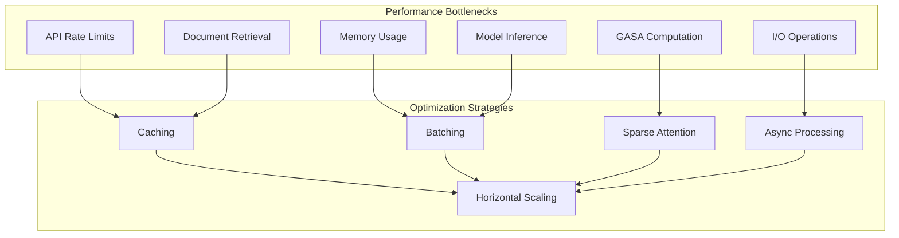

# Performance Optimization Guide

This guide covers optimizing Saplings applications for maximum performance, including GASA optimization, memory management, model configuration, and scaling strategies.

## Table of Contents

- [Performance Architecture](#performance-architecture)
- [GASA Optimization](#gasa-optimization)
- [Memory Management](#memory-management)
- [Model Configuration](#model-configuration)
- [Retrieval Optimization](#retrieval-optimization)
- [Caching Strategies](#caching-strategies)
- [Concurrency & Parallelism](#concurrency--parallelism)
- [Resource Management](#resource-management)
- [Profiling & Benchmarking](#profiling--benchmarking)
- [Production Optimizations](#production-optimizations)

## Performance Architecture

### Performance Bottlenecks Overview

Common performance bottlenecks in Saplings applications:



### Performance Metrics

Key metrics to monitor for optimization:

| Metric | Target | Critical Threshold | Optimization Strategy |
|--------|--------|-------------------|---------------------|
| **Response Time** | < 2s | > 10s | GASA optimization, caching |
| **Memory Usage** | < 70% | > 90% | Memory management, chunking |
| **CPU Utilization** | < 80% | > 95% | Async processing, scaling |
| **Cache Hit Rate** | > 80% | < 50% | Cache optimization |
| **Error Rate** | < 1% | > 5% | Error handling, fallbacks |

## GASA Optimization

### Understanding GASA Performance

Graph-Aligned Sparse Attention (GASA) is Saplings' key performance feature:

```python
from saplings import AgentBuilder
from saplings.gasa import GASAConfig, GASAStrategy

# Basic GASA configuration
gasa_config = GASAConfig(
    enabled=True,
    strategy=GASAStrategy.BINARY,
    max_hops=2,
    fallback_strategy="block_diagonal",
    cache_enabled=True,
    threshold=0.1
)

agent = AgentBuilder.for_openai("gpt-4o") \
    .with_gasa_enabled(True) \
    .with_gasa_config(gasa_config) \
    .build()
```

### GASA Strategy Comparison

| Strategy | Complexity | Memory Usage | Speed | Use Case |
|----------|------------|--------------|-------|----------|
| **BINARY** | O(n log n) | Low | Fast | General purpose |
| **ADAPTIVE** | O(n²) | Medium | Medium | Complex analysis |
| **HIERARCHICAL** | O(n log n) | Medium | Fast | Structured documents |
| **SPARSE** | O(n) | Very Low | Very Fast | Large documents |

### Optimizing GASA Configuration

```python
import psutil
import time
from typing import Dict, Any

class GASAOptimizer:
    """Automatically optimize GASA configuration based on workload."""
    
    def __init__(self, agent):
        self.agent = agent
        self.performance_history = []
        self.current_config = None
    
    async def optimize_for_workload(self, sample_tasks: list, target_response_time: float = 2.0):
        """Optimize GASA configuration for specific workload."""
        
        configs_to_test = [
            # Performance-focused
            GASAConfig(
                strategy=GASAStrategy.SPARSE,
                max_hops=1,
                threshold=0.2,
                cache_enabled=True
            ),
            # Balanced
            GASAConfig(
                strategy=GASAStrategy.BINARY,
                max_hops=2,
                threshold=0.1,
                cache_enabled=True
            ),
            # Quality-focused
            GASAConfig(
                strategy=GASAStrategy.ADAPTIVE,
                max_hops=3,
                threshold=0.05,
                cache_enabled=True
            ),
        ]
        
        best_config = None
        best_score = float('inf')
        
        for config in configs_to_test:
            # Update agent configuration
            self.agent.update_gasa_config(config)
            
            # Test performance
            performance = await self._test_performance(sample_tasks)
            
            # Calculate score (response time + quality penalty)
            score = performance['avg_response_time']
            if performance['error_rate'] > 0.05:  # 5% error rate penalty
                score += 10.0
            
            print(f"Config {config.strategy}: {score:.2f}s score")
            
            if score < best_score and performance['avg_response_time'] < target_response_time:
                best_score = score
                best_config = config
        
        if best_config:
            self.agent.update_gasa_config(best_config)
            self.current_config = best_config
            print(f"Optimal config: {best_config.strategy} (score: {best_score:.2f}s)")
        
        return best_config
    
    async def _test_performance(self, tasks: list) -> Dict[str, Any]:
        """Test performance with current configuration."""
        
        response_times = []
        errors = 0
        
        for task in tasks:
            start_time = time.time()
            try:
                result = await self.agent.run(task)
                response_time = time.time() - start_time
                response_times.append(response_time)
            except Exception as e:
                errors += 1
                print(f"Error in task: {e}")
        
        return {
            'avg_response_time': sum(response_times) / len(response_times) if response_times else float('inf'),
            'max_response_time': max(response_times) if response_times else float('inf'),
            'error_rate': errors / len(tasks),
            'total_tasks': len(tasks)
        }
    
    async def adaptive_optimization(self, monitoring_period: int = 300):
        """Continuously optimize GASA based on performance metrics."""
        
        while True:
            try:
                # Get current performance metrics
                current_perf = self.agent.get_performance_metrics()
                
                # Check if optimization is needed
                if (current_perf['avg_response_time'] > 5.0 or 
                    current_perf['memory_usage_ratio'] > 0.8):
                    
                    print("Performance degradation detected, optimizing...")
                    
                    # Reduce GASA complexity
                    if self.current_config.max_hops > 1:
                        self.current_config.max_hops -= 1
                        self.agent.update_gasa_config(self.current_config)
                        print(f"Reduced GASA hops to {self.current_config.max_hops}")
                    
                    # Switch to faster strategy if needed
                    if (current_perf['avg_response_time'] > 10.0 and 
                        self.current_config.strategy != GASAStrategy.SPARSE):
                        self.current_config.strategy = GASAStrategy.SPARSE
                        self.agent.update_gasa_config(self.current_config)
                        print("Switched to SPARSE strategy for better performance")
                
                # Check if we can increase quality
                elif (current_perf['avg_response_time'] < 1.0 and 
                      current_perf['memory_usage_ratio'] < 0.5):
                    
                    print("Good performance, increasing quality...")
                    
                    if self.current_config.max_hops < 3:
                        self.current_config.max_hops += 1
                        self.agent.update_gasa_config(self.current_config)
                        print(f"Increased GASA hops to {self.current_config.max_hops}")
                
            except Exception as e:
                print(f"Error in adaptive optimization: {e}")
            
            await asyncio.sleep(monitoring_period)

# Usage
optimizer = GASAOptimizer(agent)

# One-time optimization
sample_tasks = [
    "Analyze this document for key insights",
    "Summarize the main points",
    "Find relevant information about topic X"
]

optimal_config = await optimizer.optimize_for_workload(sample_tasks)

# Continuous optimization
asyncio.create_task(optimizer.adaptive_optimization())
```

### GASA Memory Optimization

```python
class GASAMemoryOptimizer:
    """Optimize GASA memory usage."""
    
    def __init__(self, agent):
        self.agent = agent
        self.memory_threshold = 0.8  # 80% of available memory
    
    def optimize_for_memory_constraints(self):
        """Optimize GASA configuration for memory-constrained environments."""
        
        available_memory_gb = psutil.virtual_memory().available / (1024**3)
        
        if available_memory_gb < 2:
            # Very limited memory
            config = GASAConfig(
                strategy=GASAStrategy.SPARSE,
                max_hops=1,
                threshold=0.3,
                cache_enabled=False,  # Disable cache to save memory
                batch_size=1
            )
        elif available_memory_gb < 8:
            # Limited memory
            config = GASAConfig(
                strategy=GASAStrategy.BINARY,
                max_hops=2,
                threshold=0.2,
                cache_enabled=True,
                cache_size=100,  # Small cache
                batch_size=2
            )
        else:
            # Sufficient memory
            config = GASAConfig(
                strategy=GASAStrategy.ADAPTIVE,
                max_hops=3,
                threshold=0.1,
                cache_enabled=True,
                cache_size=1000,
                batch_size=4
            )
        
        self.agent.update_gasa_config(config)
        print(f"Optimized for {available_memory_gb:.1f}GB memory: {config.strategy}")
        
        return config
    
    async def dynamic_memory_management(self):
        """Dynamically adjust GASA based on memory usage."""
        
        while True:
            memory_percent = psutil.virtual_memory().percent
            
            if memory_percent > 90:
                # Critical memory usage - emergency optimization
                emergency_config = GASAConfig(
                    strategy=GASAStrategy.SPARSE,
                    max_hops=1,
                    threshold=0.5,
                    cache_enabled=False
                )
                self.agent.update_gasa_config(emergency_config)
                print("Emergency memory optimization activated")
                
                # Clear caches
                self.agent.clear_all_caches()
                
            elif memory_percent > 80:
                # High memory usage - reduce GASA complexity
                current_config = self.agent.get_gasa_config()
                if current_config.max_hops > 1:
                    current_config.max_hops = max(1, current_config.max_hops - 1)
                    current_config.cache_size = max(10, current_config.cache_size // 2)
                    self.agent.update_gasa_config(current_config)
                    print(f"Reduced GASA complexity due to memory pressure")
            
            elif memory_percent < 50:
                # Low memory usage - can increase quality
                current_config = self.agent.get_gasa_config()
                if current_config.max_hops < 3:
                    current_config.max_hops = min(3, current_config.max_hops + 1)
                    self.agent.update_gasa_config(current_config)
            
            await asyncio.sleep(30)  # Check every 30 seconds

# Usage
memory_optimizer = GASAMemoryOptimizer(agent)
memory_optimizer.optimize_for_memory_constraints()
asyncio.create_task(memory_optimizer.dynamic_memory_management())
```

## Memory Management

### Efficient Memory Usage

```python
from saplings.memory import MemoryOptimizer, ChunkingStrategy

class AdvancedMemoryManager:
    """Advanced memory management for Saplings agents."""
    
    def __init__(self, agent):
        self.agent = agent
        self.memory_optimizer = MemoryOptimizer()
        self.chunk_size = 1000  # Default chunk size
    
    def optimize_document_processing(self, documents: list, max_memory_mb: int = 1024):
        """Optimize document processing for memory constraints."""
        
        # Calculate optimal chunk size
        total_size = sum(len(doc) for doc in documents)
        optimal_chunks = max(1, total_size // (max_memory_mb * 1024))
        chunk_size = max(100, len(documents) // optimal_chunks)
        
        print(f"Processing {len(documents)} documents in chunks of {chunk_size}")
        
        results = []
        for i in range(0, len(documents), chunk_size):
            chunk = documents[i:i + chunk_size]
            
            # Clear memory before processing chunk
            self.agent.clear_working_memory()
            
            # Process chunk
            chunk_result = self._process_document_chunk(chunk)
            results.append(chunk_result)
            
            # Optional: Force garbage collection
            import gc
            gc.collect()
        
        return results
    
    def _process_document_chunk(self, documents: list):
        """Process a chunk of documents efficiently."""
        
        # Add documents to memory
        for doc in documents:
            self.agent.add_document(doc, metadata={"chunk": True})
        
        # Process with memory-efficient retrieval
        result = self.agent.run(
            "Analyze these documents",
            retrieval_max_documents=min(10, len(documents)),
            use_memory_efficient_mode=True
        )
        
        return result
    
    async def streaming_document_processing(self, document_stream):
        """Process documents as a stream to minimize memory usage."""
        
        buffer = []
        buffer_size = 0
        max_buffer_size = 1024 * 1024  # 1MB buffer
        
        async for document in document_stream:
            buffer.append(document)
            buffer_size += len(document)
            
            # Process buffer when it reaches max size
            if buffer_size >= max_buffer_size:
                result = await self._process_document_chunk(buffer)
                yield result
                
                # Clear buffer
                buffer.clear()
                buffer_size = 0
        
        # Process remaining documents
        if buffer:
            result = await self._process_document_chunk(buffer)
            yield result

# Usage
memory_manager = AdvancedMemoryManager(agent)

# Batch processing with memory optimization
large_document_set = [f"Document {i} content..." for i in range(1000)]
results = memory_manager.optimize_document_processing(
    large_document_set, 
    max_memory_mb=512
)

# Streaming processing
async def document_generator():
    for i in range(10000):
        yield f"Large document {i} with lots of content..."

async for result in memory_manager.streaming_document_processing(document_generator()):
    print(f"Processed chunk: {len(result)} characters")
```

### Memory Pool Management

```python
import threading
from queue import Queue
from typing import Optional

class MemoryPool:
    """Memory pool for reusing agent instances."""
    
    def __init__(self, pool_size: int = 5):
        self.pool_size = pool_size
        self.available_agents = Queue(maxsize=pool_size)
        self.lock = threading.Lock()
        self.total_agents = 0
    
    def get_agent(self) -> Optional[object]:
        """Get an agent from the pool."""
        try:
            return self.available_agents.get_nowait()
        except:
            if self.total_agents < self.pool_size:
                # Create new agent
                agent = self._create_new_agent()
                self.total_agents += 1
                return agent
            else:
                # Pool exhausted, wait for available agent
                return self.available_agents.get(timeout=30)
    
    def return_agent(self, agent):
        """Return an agent to the pool after cleaning up."""
        # Clean up agent state
        agent.clear_working_memory()
        agent.reset_conversation_history()
        
        # Return to pool
        try:
            self.available_agents.put_nowait(agent)
        except:
            # Pool is full, destroy agent
            del agent
            self.total_agents -= 1
    
    def _create_new_agent(self):
        """Create a new optimized agent."""
        return AgentBuilder.for_openai("gpt-4o") \
            .with_gasa_enabled(True) \
            .with_memory_optimization_enabled(True) \
            .build()
    
    def shutdown(self):
        """Shutdown the pool and clean up all agents."""
        while not self.available_agents.empty():
            agent = self.available_agents.get()
            del agent

# Usage
pool = MemoryPool(pool_size=3)

async def process_with_pool(task):
    agent = pool.get_agent()
    try:
        result = await agent.run(task)
        return result
    finally:
        pool.return_agent(agent)

# Process multiple tasks concurrently with pooled agents
tasks = ["Task 1", "Task 2", "Task 3", "Task 4", "Task 5"]
results = await asyncio.gather(*[process_with_pool(task) for task in tasks])
```

## Model Configuration

### Model Performance Optimization

```python
from saplings.models import ModelOptimizer, ModelConfig

class ModelPerformanceOptimizer:
    """Optimize model configuration for performance."""
    
    def __init__(self):
        self.model_configs = {
            "speed_focused": ModelConfig(
                temperature=0.7,
                max_tokens=1000,
                top_p=0.9,
                frequency_penalty=0.1,
                presence_penalty=0.1,
                request_timeout=10,
            ),
            "quality_focused": ModelConfig(
                temperature=0.3,
                max_tokens=2000,
                top_p=0.95,
                frequency_penalty=0.0,
                presence_penalty=0.0,
                request_timeout=30,
            ),
            "balanced": ModelConfig(
                temperature=0.5,
                max_tokens=1500,
                top_p=0.9,
                frequency_penalty=0.05,
                presence_penalty=0.05,
                request_timeout=20,
            )
        }
    
    def get_optimized_config(self, use_case: str, response_time_target: float = 5.0):
        """Get optimized configuration based on use case and performance target."""
        
        if response_time_target < 2.0:
            base_config = self.model_configs["speed_focused"]
        elif response_time_target > 10.0:
            base_config = self.model_configs["quality_focused"]
        else:
            base_config = self.model_configs["balanced"]
        
        # Adjust based on use case
        if use_case == "summarization":
            base_config.max_tokens = min(base_config.max_tokens, 500)
            base_config.temperature = 0.3
        elif use_case == "creative_writing":
            base_config.temperature = 0.8
            base_config.top_p = 0.95
        elif use_case == "analysis":
            base_config.temperature = 0.2
            base_config.max_tokens = 2000
        
        return base_config

# Model selection optimization
class ModelSelector:
    """Select optimal model based on task characteristics."""
    
    def __init__(self):
        self.model_performance = {
            "gpt-4o": {"speed": 0.7, "quality": 0.95, "cost": 0.3},
            "gpt-4o-mini": {"speed": 0.9, "quality": 0.8, "cost": 0.8},
            "gpt-3.5-turbo": {"speed": 0.95, "quality": 0.7, "cost": 0.9},
        }
    
    def select_optimal_model(self, task_complexity: str, speed_priority: float = 0.5):
        """Select optimal model based on task complexity and speed priority."""
        
        complexity_weights = {
            "simple": {"speed": 0.8, "quality": 0.2},
            "medium": {"speed": 0.5, "quality": 0.5},
            "complex": {"speed": 0.2, "quality": 0.8}
        }
        
        weights = complexity_weights.get(task_complexity, complexity_weights["medium"])
        
        best_model = None
        best_score = 0
        
        for model, perf in self.model_performance.items():
            score = (weights["speed"] * perf["speed"] + 
                    weights["quality"] * perf["quality"])
            
            if score > best_score:
                best_score = score
                best_model = model
        
        return best_model

# Usage
optimizer = ModelPerformanceOptimizer()
selector = ModelSelector()

# Create optimized agent
optimal_model = selector.select_optimal_model("medium", speed_priority=0.7)
optimal_config = optimizer.get_optimized_config("analysis", response_time_target=3.0)

agent = AgentBuilder.for_openai(optimal_model) \
    .with_model_config(optimal_config) \
    .build()
```

### Request Batching and Caching

```python
import asyncio
from typing import List, Tuple, Dict
import hashlib
import time

class RequestBatcher:
    """Batch multiple requests for improved performance."""
    
    def __init__(self, batch_size: int = 5, batch_timeout: float = 1.0):
        self.batch_size = batch_size
        self.batch_timeout = batch_timeout
        self.pending_requests = []
        self.request_cache = {}
        self.cache_ttl = 300  # 5 minutes
    
    async def execute_request(self, agent, task: str) -> str:
        """Execute request with batching and caching."""
        
        # Check cache first
        cache_key = self._generate_cache_key(task)
        cached_result = self._get_cached_result(cache_key)
        if cached_result:
            return cached_result
        
        # Add to batch
        future = asyncio.Future()
        self.pending_requests.append((task, future))
        
        # Process batch if it's full or timeout
        if len(self.pending_requests) >= self.batch_size:
            await self._process_batch(agent)
        else:
            # Set timeout for batch processing
            asyncio.create_task(self._batch_timeout_handler(agent))
        
        # Wait for result
        result = await future
        
        # Cache result
        self._cache_result(cache_key, result)
        
        return result
    
    async def _process_batch(self, agent):
        """Process a batch of requests."""
        if not self.pending_requests:
            return
        
        current_batch = self.pending_requests.copy()
        self.pending_requests.clear()
        
        # Create combined prompt for batch processing
        batch_prompt = self._create_batch_prompt([req[0] for req in current_batch])
        
        try:
            # Execute batch
            batch_result = await agent.run(batch_prompt)
            
            # Parse and distribute results
            individual_results = self._parse_batch_result(batch_result, len(current_batch))
            
            for i, (task, future) in enumerate(current_batch):
                if i < len(individual_results):
                    future.set_result(individual_results[i])
                else:
                    future.set_result("Error processing request")
                    
        except Exception as e:
            # Handle errors
            for task, future in current_batch:
                future.set_exception(e)
    
    async def _batch_timeout_handler(self, agent):
        """Handle batch timeout."""
        await asyncio.sleep(self.batch_timeout)
        if self.pending_requests:
            await self._process_batch(agent)
    
    def _create_batch_prompt(self, tasks: List[str]) -> str:
        """Create a combined prompt for batch processing."""
        numbered_tasks = [f"{i+1}. {task}" for i, task in enumerate(tasks)]
        return f"""Process the following tasks and provide numbered responses:

{chr(10).join(numbered_tasks)}

Please respond with numbered answers corresponding to each task."""
    
    def _parse_batch_result(self, result: str, expected_count: int) -> List[str]:
        """Parse batch result into individual responses."""
        lines = result.split('\n')
        responses = []
        current_response = []
        
        for line in lines:
            if line.strip().startswith(tuple(f"{i}." for i in range(1, expected_count + 1))):
                if current_response:
                    responses.append('\n'.join(current_response).strip())
                    current_response = []
                current_response.append(line[line.index('.') + 1:].strip())
            else:
                current_response.append(line)
        
        if current_response:
            responses.append('\n'.join(current_response).strip())
        
        return responses
    
    def _generate_cache_key(self, task: str) -> str:
        """Generate cache key for task."""
        return hashlib.md5(task.encode()).hexdigest()
    
    def _get_cached_result(self, cache_key: str) -> str:
        """Get cached result if still valid."""
        if cache_key in self.request_cache:
            result, timestamp = self.request_cache[cache_key]
            if time.time() - timestamp < self.cache_ttl:
                return result
            else:
                del self.request_cache[cache_key]
        return None
    
    def _cache_result(self, cache_key: str, result: str):
        """Cache result with timestamp."""
        self.request_cache[cache_key] = (result, time.time())

# Usage
batcher = RequestBatcher(batch_size=3, batch_timeout=0.5)

async def optimized_processing():
    tasks = [
        "Summarize this text",
        "Extract key points",
        "Identify sentiment",
        "Generate questions",
        "Create outline"
    ]
    
    # Process with batching
    results = await asyncio.gather(*[
        batcher.execute_request(agent, task) for task in tasks
    ])
    
    return results

results = await optimized_processing()
```

## Retrieval Optimization

### Advanced Retrieval Strategies

```python
from saplings.retrieval import RetrievalOptimizer, RetrievalStrategy

class AdvancedRetrievalOptimizer:
    """Advanced retrieval optimization strategies."""
    
    def __init__(self, agent):
        self.agent = agent
        self.retrieval_cache = {}
        self.query_optimizer = QueryOptimizer()
    
    async def optimize_retrieval_performance(self, query: str, max_documents: int = 10):
        """Optimize retrieval for performance and relevance."""
        
        # Step 1: Optimize query
        optimized_query = self.query_optimizer.optimize_query(query)
        
        # Step 2: Check cache
        cache_key = self._generate_retrieval_cache_key(optimized_query, max_documents)
        if cache_key in self.retrieval_cache:
            return self.retrieval_cache[cache_key]
        
        # Step 3: Use hierarchical retrieval
        documents = await self._hierarchical_retrieval(optimized_query, max_documents)
        
        # Step 4: Cache results
        self.retrieval_cache[cache_key] = documents
        
        return documents
    
    async def _hierarchical_retrieval(self, query: str, max_documents: int):
        """Implement hierarchical retrieval for better performance."""
        
        # First pass: Fast, broad retrieval
        candidate_docs = await self.agent.retrieve_documents(
            query,
            max_documents=max_documents * 3,  # Get more candidates
            strategy=RetrievalStrategy.FAST
        )
        
        # Second pass: Re-rank with more sophisticated scoring
        if len(candidate_docs) > max_documents:
            reranked_docs = await self._rerank_documents(query, candidate_docs)
            return reranked_docs[:max_documents]
        
        return candidate_docs
    
    async def _rerank_documents(self, query: str, documents: list):
        """Re-rank documents using advanced scoring."""
        
        scores = []
        for doc in documents:
            # Calculate multiple relevance scores
            semantic_score = await self._calculate_semantic_similarity(query, doc)
            keyword_score = self._calculate_keyword_overlap(query, doc)
            freshness_score = self._calculate_freshness_score(doc)
            
            # Weighted combination
            total_score = (
                0.6 * semantic_score +
                0.3 * keyword_score +
                0.1 * freshness_score
            )
            
            scores.append((total_score, doc))
        
        # Sort by score and return documents
        scores.sort(reverse=True, key=lambda x: x[0])
        return [doc for score, doc in scores]
    
    async def _calculate_semantic_similarity(self, query: str, document: str) -> float:
        """Calculate semantic similarity between query and document."""
        # This would use the agent's embedding model
        query_embedding = await self.agent.get_embedding(query)
        doc_embedding = await self.agent.get_embedding(document)
        
        # Calculate cosine similarity
        import numpy as np
        similarity = np.dot(query_embedding, doc_embedding) / (
            np.linalg.norm(query_embedding) * np.linalg.norm(doc_embedding)
        )
        
        return float(similarity)
    
    def _calculate_keyword_overlap(self, query: str, document: str) -> float:
        """Calculate keyword overlap score."""
        query_words = set(query.lower().split())
        doc_words = set(document.lower().split())
        
        if not query_words:
            return 0.0
        
        overlap = len(query_words.intersection(doc_words))
        return overlap / len(query_words)
    
    def _calculate_freshness_score(self, document: str) -> float:
        """Calculate document freshness score."""
        # This would depend on document metadata
        # For now, return neutral score
        return 0.5
    
    def _generate_retrieval_cache_key(self, query: str, max_docs: int) -> str:
        """Generate cache key for retrieval."""
        return hashlib.md5(f"{query}:{max_docs}".encode()).hexdigest()

class QueryOptimizer:
    """Optimize queries for better retrieval performance."""
    
    def optimize_query(self, query: str) -> str:
        """Optimize query for better retrieval."""
        
        # Remove stop words
        stop_words = {'the', 'a', 'an', 'and', 'or', 'but', 'in', 'on', 'at', 'to', 'for', 'of', 'with', 'by'}
        words = [word for word in query.lower().split() if word not in stop_words]
        
        # Expand with synonyms for important terms
        expanded_words = []
        for word in words:
            expanded_words.append(word)
            synonyms = self._get_synonyms(word)
            expanded_words.extend(synonyms[:2])  # Add up to 2 synonyms
        
        return ' '.join(expanded_words)
    
    def _get_synonyms(self, word: str) -> list:
        """Get synonyms for a word (simplified implementation)."""
        synonym_map = {
            'analyze': ['examine', 'study'],
            'find': ['locate', 'discover'],
            'create': ['generate', 'produce'],
            'summary': ['overview', 'synopsis'],
        }
        return synonym_map.get(word, [])

# Usage
retrieval_optimizer = AdvancedRetrievalOptimizer(agent)

# Optimized retrieval
documents = await retrieval_optimizer.optimize_retrieval_performance(
    "Find information about machine learning algorithms",
    max_documents=5
)
```

## Caching Strategies

### Multi-Level Caching

```python
import redis
import pickle
from typing import Any, Optional
import asyncio

class MultiLevelCache:
    """Multi-level caching system for Saplings."""
    
    def __init__(self, redis_url: str = "redis://localhost:6379"):
        self.memory_cache = {}  # L1 cache
        self.redis_client = redis.from_url(redis_url)  # L2 cache
        self.memory_cache_size = 1000
        self.default_ttl = 3600  # 1 hour
    
    async def get(self, key: str) -> Optional[Any]:
        """Get value from cache (checks L1, then L2)."""
        
        # Check L1 cache (memory)
        if key in self.memory_cache:
            value, expiry = self.memory_cache[key]
            if time.time() < expiry:
                return value
            else:
                del self.memory_cache[key]
        
        # Check L2 cache (Redis)
        try:
            serialized_value = self.redis_client.get(key)
            if serialized_value:
                value = pickle.loads(serialized_value)
                # Promote to L1 cache
                self._set_memory_cache(key, value, self.default_ttl)
                return value
        except Exception as e:
            print(f"Redis cache error: {e}")
        
        return None
    
    async def set(self, key: str, value: Any, ttl: int = None) -> bool:
        """Set value in both cache levels."""
        ttl = ttl or self.default_ttl
        
        # Set in L1 cache (memory)
        self._set_memory_cache(key, value, ttl)
        
        # Set in L2 cache (Redis)
        try:
            serialized_value = pickle.dumps(value)
            self.redis_client.setex(key, ttl, serialized_value)
            return True
        except Exception as e:
            print(f"Redis cache error: {e}")
            return False
    
    def _set_memory_cache(self, key: str, value: Any, ttl: int):
        """Set value in memory cache with LRU eviction."""
        
        # Evict oldest entries if cache is full
        if len(self.memory_cache) >= self.memory_cache_size:
            # Simple LRU: remove 10% of oldest entries
            sorted_items = sorted(
                self.memory_cache.items(),
                key=lambda x: x[1][1]  # Sort by expiry time
            )
            for i in range(len(sorted_items) // 10):
                del self.memory_cache[sorted_items[i][0]]
        
        expiry = time.time() + ttl
        self.memory_cache[key] = (value, expiry)
    
    async def invalidate(self, pattern: str = None):
        """Invalidate cache entries."""
        if pattern:
            # Clear specific pattern
            if pattern in self.memory_cache:
                del self.memory_cache[pattern]
            try:
                self.redis_client.delete(pattern)
            except:
                pass
        else:
            # Clear all
            self.memory_cache.clear()
            try:
                self.redis_client.flushdb()
            except:
                pass

class CacheManager:
    """Manage caching for different Saplings operations."""
    
    def __init__(self, agent):
        self.agent = agent
        self.cache = MultiLevelCache()
        self.cache_strategies = {
            'llm_response': {'ttl': 3600, 'enabled': True},
            'document_embedding': {'ttl': 86400, 'enabled': True},  # 24 hours
            'retrieval_results': {'ttl': 1800, 'enabled': True},    # 30 minutes
            'gasa_computation': {'ttl': 7200, 'enabled': True},     # 2 hours
        }
    
    async def cached_llm_call(self, prompt: str, **kwargs) -> str:
        """Cache LLM responses."""
        if not self.cache_strategies['llm_response']['enabled']:
            return await self.agent.run(prompt, **kwargs)
        
        # Generate cache key
        cache_key = self._generate_llm_cache_key(prompt, kwargs)
        
        # Check cache
        cached_result = await self.cache.get(cache_key)
        if cached_result:
            return cached_result
        
        # Execute and cache
        result = await self.agent.run(prompt, **kwargs)
        await self.cache.set(
            cache_key, 
            result, 
            self.cache_strategies['llm_response']['ttl']
        )
        
        return result
    
    async def cached_document_embedding(self, text: str) -> list:
        """Cache document embeddings."""
        if not self.cache_strategies['document_embedding']['enabled']:
            return await self.agent.get_embedding(text)
        
        cache_key = f"embedding:{hashlib.md5(text.encode()).hexdigest()}"
        
        cached_result = await self.cache.get(cache_key)
        if cached_result:
            return cached_result
        
        embedding = await self.agent.get_embedding(text)
        await self.cache.set(
            cache_key,
            embedding,
            self.cache_strategies['document_embedding']['ttl']
        )
        
        return embedding
    
    def _generate_llm_cache_key(self, prompt: str, kwargs: dict) -> str:
        """Generate cache key for LLM calls."""
        # Include relevant parameters in cache key
        key_data = {
            'prompt': prompt,
            'model': kwargs.get('model'),
            'temperature': kwargs.get('temperature'),
            'max_tokens': kwargs.get('max_tokens'),
        }
        
        key_string = str(sorted(key_data.items()))
        return f"llm:{hashlib.md5(key_string.encode()).hexdigest()}"
    
    async def warm_cache(self, common_queries: list):
        """Pre-warm cache with common queries."""
        print("Warming up cache...")
        
        tasks = []
        for query in common_queries:
            task = self.cached_llm_call(query)
            tasks.append(task)
        
        # Execute all queries concurrently
        await asyncio.gather(*tasks)
        print(f"Cache warmed up with {len(common_queries)} queries")

# Usage
cache_manager = CacheManager(agent)

# Warm up cache
common_queries = [
    "What is machine learning?",
    "Explain neural networks",
    "Summarize this document",
]
await cache_manager.warm_cache(common_queries)

# Use cached operations
result = await cache_manager.cached_llm_call("What is machine learning?")  # Cache hit
embedding = await cache_manager.cached_document_embedding("Sample text")
```

This comprehensive performance optimization guide provides users with advanced techniques to maximize Saplings application performance across all aspects of the system.