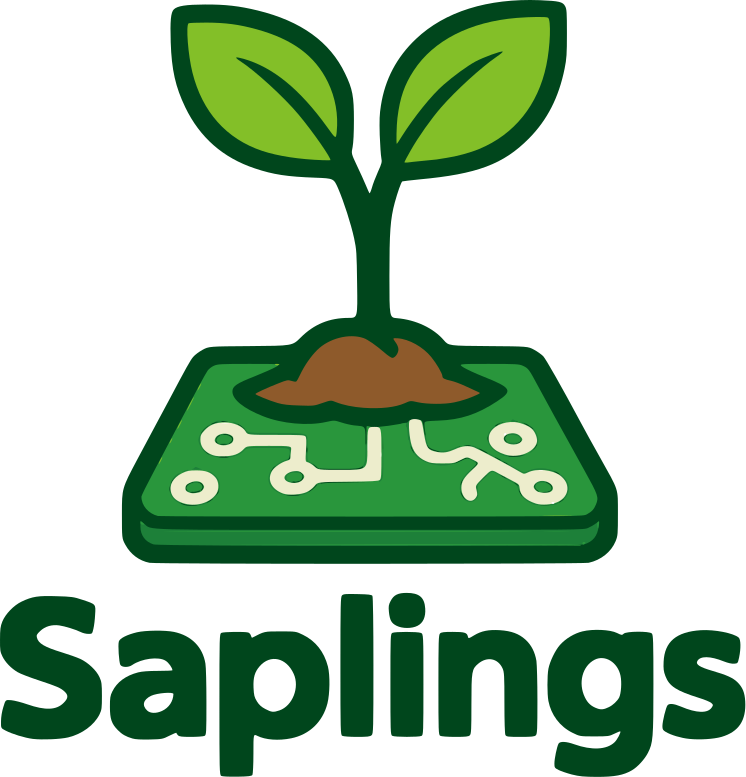

# Saplings 🌱

A graph-first, self-improving agent framework that takes root in your repository or knowledge base, builds a structural map, and grows smarter each day through automated critique → fine-tune loops—all without locking you to a single model provider.



- Provided by [Fine-Tuna](https://fine-tuna.ai): A dataset creation and fine-tuning agency.

## What is Saplings?

Saplings is a Python framework for building intelligent agents that can understand, reason about, and interact with complex information structures like codebases, knowledge bases, and document collections. Unlike traditional RAG (Retrieval-Augmented Generation) systems that treat documents as isolated chunks, Saplings builds and leverages structural relationships between information pieces, enabling more coherent and accurate reasoning.

The framework's name reflects its philosophy: every "sapling" starts small but takes root in your data, builds a structural map, and grows smarter through continuous learning and self-improvement.

## When to Use Saplings

Saplings is ideal for scenarios where:

- **Complex Information Structures**: You're working with interconnected information (codebases, technical documentation, research papers)
- **Contextual Understanding**: You need agents that understand relationships between different pieces of information
- **Long-Term Value**: You want agents that improve over time through usage
- **Customization**: You need fine-grained control over retrieval, reasoning, and generation
- **Cost Efficiency**: You want to optimize token usage and computational resources
- **Privacy**: You need control over how your data is processed and stored

### Ideal Use Cases

- **Code Understanding & Generation**: Analyzing codebases, generating documentation, suggesting improvements
- **Research Assistance**: Analyzing research papers, identifying connections, generating insights
- **Knowledge Management**: Organizing and retrieving information from complex knowledge bases
- **Technical Support**: Providing contextually aware answers to technical questions
- **Data Analysis**: Extracting insights from structured and unstructured data sources
- **Multi-step Reasoning**: Tasks requiring planning and sequential decision-making

## When NOT to Use Saplings

Saplings may not be the best choice when:

- **Simple Q&A**: For straightforward question-answering without context, simpler frameworks may suffice
- **Static Outputs**: When you need fixed, predictable outputs without dynamic decision-making
- **Minimal Context**: When context and relationships between information aren't important
- **Single-use Applications**: When you don't need agents that improve over time
- **Extremely Resource-constrained Environments**: The full framework may be overkill for very limited computing environments

For simple tasks with well-defined outputs, consider using:
- Direct API calls to language models
- Template-based generation systems
- Rule-based systems
- Traditional information retrieval

## Key Features

- **Structural Memory** — Vector + graph store per corpus with relationship tracking
- **Cascaded, Entropy-Aware Retrieval** — TF-IDF → embeddings → graph expansion for optimal context selection
- **Guard-railed Generation** — Planner with budget awareness, Executor with speculative draft/verify cycles
- **JudgeAgent & Validator Loop** — Reflexive scoring, self-healing patches for continuous improvement
- **Self-Healing & Adaptation** — Error analysis, automatic patching, and LoRA fine-tuning
- **Extensibility** — Hot-pluggable models, tools, validators with a unified interface
- **Graph-Aligned Sparse Attention (GASA)** — Graph-conditioned attention masks for faster, better-grounded reasoning
- **Comprehensive Monitoring** — Tracing, visualization, and performance analysis tools

## How It Differs From Existing Libraries

| Feature | Saplings | LlamaIndex | LangChain | AutoGPT |
|---------|---------|------------|-----------|---------|
| Memory model | Vector + dependency graph, SecureStore | Vector stores (graph optional) | Vector stores | Short-term memory only |
| Context packing | Graph-Aligned Sparse Attention (GASA) → 40% fewer FLOPs | Dense concat or basic chunk window | Dense concat | Dense concat |
| Self-improvement | Built-in JudgeAgent + Validator → daily LoRA adapters, online RL | Manual re-index / retrain only | None | Limited |
| Extensibility | Plug-in adapters, indexers, validators, dynamic tool synthesis | Integrations but no dynamic tool creation | Tool integrations | Fixed tool set |
| Cost governance | Budget-aware planner, usage metering | None | Basic tracking | None |
| Privacy | Hash-key, DP-noise SecureStore | Varies by vector DB | Depends on implementation | Limited |
| Model support | Multiple providers, local models, custom adapters | Multiple providers | Multiple providers | Primarily OpenAI |
| Monitoring | Comprehensive tracing, visualization, blame graph | Basic | Basic | Limited |

## Core Concepts

### Agent Architecture

Saplings agents are composed of several key components:

1. **Memory**: Stores and indexes documents, code, and other information
   - The `MemoryStore` is an in-memory object by default that combines vector storage and graph-based memory
   - Memory can be persisted to disk using `memory_store.save("path/to/directory")` and loaded with `memory_store.load("path/to/directory")`
   - When saved, it creates a directory structure with vector embeddings, dependency graph data, and configuration
2. **Retriever**: Finds relevant information based on queries
3. **Planner**: Breaks down complex tasks into steps
4. **Executor**: Carries out individual steps using models and tools
5. **Validator**: Verifies outputs against expectations
6. **JudgeAgent**: Evaluates overall performance and suggests improvements
7. **Tool Factory**: Dynamically creates tools based on needs

### Graph-Aligned Sparse Attention (GASA)

GASA is a novel technique that injects learned binary attention masks—derived from retrieval dependency graphs—into transformer layers. This allows:

- Full attention between tokens whose source chunks are within a defined number of hops in the graph
- Routing other tokens through lightweight global summary tokens
- Reducing computational costs while improving grounding
- Empirically fewer hallucinations in outputs

#### GASA with Third-Party LLMs

When using GASA with third-party APIs like OpenAI and Anthropic:
- Full GASA implementation is only possible with local models (vLLM) where we have direct access to the attention mechanism
- With third-party APIs, Saplings uses a "soft GASA" approach that performs intelligent context packing based on the dependency graph
- The `enable_gasa` flag still works with third-party models, but activates context optimization rather than true sparse attention masks

### Self-Improvement Loop

Saplings agents improve over time through:

1. **Performance Monitoring**: Tracking success rates, errors, and efficiency
2. **Validation**: Checking outputs against expected criteria
3. **Judgment**: Evaluating overall performance using JudgeAgent and identifying improvement areas
4. **Adaptation**: Automatically adjusting prompts, retrieval strategies, and other parameters
5. **Fine-tuning**: Creating specialized LoRA adapters for recurring tasks

## Installation

```bash
pip install saplings
```

For development installations with all optional dependencies:

```bash
pip install "saplings[dev,viz,monitoring]"
```

## API Key Setup

Saplings supports multiple model providers, each requiring their own API keys. Here's how to set them up:

### Setting Environment Variables

The recommended way to provide API keys is through environment variables:

```bash
# For OpenAI
export OPENAI_API_KEY=your_openai_api_key

# For Anthropic
export ANTHROPIC_API_KEY=your_anthropic_api_key

# For HuggingFace Hub (if using their API)
export HUGGINGFACE_API_KEY=your_huggingface_api_key
```

### Using a .env File

You can also use a `.env` file in your project root:

```
# .env file
OPENAI_API_KEY=your_openai_api_key
ANTHROPIC_API_KEY=your_anthropic_api_key
HUGGINGFACE_API_KEY=your_huggingface_api_key
```

Then load it in your Python code:

```python
from dotenv import load_dotenv
load_dotenv()  # Load environment variables from .env file
```

### Specifying API Keys in Code

While not recommended for production, you can also specify API keys directly in the model URI:

```python
# OpenAI
model = LLM.from_uri("openai://gpt-4?api_key=your_openai_api_key")

# Anthropic
model = LLM.from_uri("anthropic://claude-3-opus-20240229?api_key=your_anthropic_api_key")
```

## Model Providers

Saplings supports multiple model providers that can be easily switched using the model URI format:

### Available Providers

| Provider | URI Format | Example |
|----------|------------|---------|
| OpenAI | `openai://model_name` | `openai://gpt-4o` |
| Anthropic | `anthropic://model_name` | `anthropic://claude-3-opus-20240229` |
| vLLM (local) | `vllm://model_name` | `vllm://meta-llama/Llama-3.1-8B-Instruct` |
| HuggingFace | `huggingface://model_name` | `huggingface://meta-llama/Llama-3-8b-instruct` |

### Changing Providers

You can easily switch between providers by changing the model URI:

```python
# Using OpenAI
config = AgentConfig(model_uri="openai://gpt-4o")

# Using Anthropic
config = AgentConfig(model_uri="anthropic://claude-3-opus-20240229")

# Using vLLM (local)
config = AgentConfig(model_uri="vllm://meta-llama/Llama-3.1-8B-Instruct")
```

### Provider-Specific Parameters

Each provider supports additional parameters in the URI:

```python
# OpenAI with parameters
model_uri = "openai://gpt-4o?temperature=0.7&max_tokens=1024"

# Anthropic with parameters
model_uri = "anthropic://claude-3-opus-20240229?temperature=0.5&max_tokens=2048"

# vLLM with parameters
model_uri = "vllm://meta-llama/Llama-3.1-8B-Instruct?temperature=0.8&quantization=awq"
```

## Quick Start

### Basic Agent

```python
from saplings import Agent, AgentConfig
from saplings.memory import MemoryStore

# Initialize a memory store with your repository
memory = MemoryStore()
memory.index_repository("/path/to/your/repo")

# Create an agent configuration
# Note: memory_path enables automatic persistence of the memory store
config = AgentConfig(
    model_uri="openai://gpt-4o",
    memory_path="./agent_memory"  # Directory where memory will be saved/loaded
)

# Create an agent with the configuration
agent = Agent(config=config)

# Set the memory store
agent.memory_store = memory

# Memory will be automatically saved to the memory_path directory
# You can also manually save/load memory:
# memory.save("./custom_memory_path")
# memory.load("./custom_memory_path")

# Run a task (note: this is an async method)
import asyncio
result = asyncio.run(agent.run("Explain the architecture of this codebase"))
print(result)
```

### Custom Agent with GASA

```python
from saplings import Agent, AgentConfig
from saplings.memory import MemoryStore, DependencyGraph
from saplings.gasa import GASAConfig
from saplings.executor import ExecutorConfig

# Initialize memory components
memory = MemoryStore()
graph = DependencyGraph()

# Index a repository
memory.index_repository("/path/to/your/repo")
graph.build_from_memory(memory)

# Configure GASA
gasa_config = GASAConfig(
    max_hops=2,  # Maximum graph distance for attention
    mask_strategy="binary",  # Binary attention mask
)

# Configure executor
executor_config = ExecutorConfig(
    enable_gasa=True,
    max_tokens=1024,
    temperature=0.7,
)

# Create agent configuration
config = AgentConfig(
    model_uri="openai://gpt-4o",
    memory_path="./agent_memory",
    enable_gasa=True,
    gasa_max_hops=2,
    max_tokens=1024,
    temperature=0.7,
)

# Create agent with custom configuration
agent = Agent(config=config)

# Set memory components
agent.memory_store = memory
agent.dependency_graph = graph

# Run a task (note: this is an async method)
import asyncio
result = asyncio.run(agent.run("Refactor the error handling in the authentication module"))
print(result)
```

### Agent with Monitoring

```python
from saplings import Agent, AgentConfig
from saplings.memory import MemoryStore
from saplings.monitoring import MonitoringConfig, TraceManager

# Configure monitoring
monitoring_config = MonitoringConfig(
    visualization_output_dir="./visualizations",
)
trace_manager = TraceManager(config=monitoring_config)

# Create agent configuration
config = AgentConfig(
    model_uri="openai://gpt-4o",
    memory_path="./agent_memory",
    enable_monitoring=True,
)

# Create agent with monitoring
agent = Agent(config=config)
agent.memory_store = MemoryStore()
agent.trace_manager = trace_manager

# Run a task with tracing (note: this is an async method)
import asyncio
result = asyncio.run(agent.run("Analyze the performance bottlenecks in this codebase"))

# Get the trace ID from the result
trace_id = result.get("trace_id", "performance-analysis-1")

# Visualize the execution trace
from saplings.monitoring import TraceViewer
viewer = TraceViewer(trace_manager=trace_manager)
viewer.view_trace(
    trace_id=trace_id,
    output_path="performance_analysis_trace.html",
    show=True,
)
```

## Multi-Agent Orchestration

Saplings supports orchestrating multiple specialized agents that work together:

```python
from saplings import Agent, AgentConfig
from saplings.memory import MemoryStore
from saplings.orchestration import GraphRunner, GraphRunnerConfig, AgentNode
from saplings.core.model_adapter import LLM

# Create a model for orchestration
model = LLM.from_uri("openai://gpt-4o")

# Create a graph runner for agent coordination
graph_runner = GraphRunner(model=model)

# Create specialized agents
code_analyzer = Agent(AgentConfig(
    model_uri="openai://gpt-4o",
    name="CodeAnalyzer",
))
code_analyzer.memory_store = MemoryStore()

refactoring_expert = Agent(AgentConfig(
    model_uri="openai://gpt-4o",
    name="RefactoringExpert",
))
refactoring_expert.memory_store = MemoryStore()

documentation_writer = Agent(AgentConfig(
    model_uri="openai://gpt-4o",
    name="DocumentationWriter",
))
documentation_writer.memory_store = MemoryStore()

# Register agents with the graph runner
graph_runner.register_agent(AgentNode(
    id="code_analyzer",
    name="Code Analyzer",
    description="Analyzes code structure and identifies patterns",
))

graph_runner.register_agent(AgentNode(
    id="refactoring_expert",
    name="Refactoring Expert",
    description="Suggests and implements code refactoring",
))

graph_runner.register_agent(AgentNode(
    id="documentation_writer",
    name="Documentation Writer",
    description="Creates clear, comprehensive documentation",
))

# Run a debate between agents (note: this is an async method)
import asyncio
result = asyncio.run(graph_runner.run_debate(
    task="Improve the error handling in auth.py and update the documentation",
    agent_ids=["code_analyzer", "refactoring_expert", "documentation_writer"]
))
```

## Advanced Usage

### Custom Model Adapters

```python
from saplings.core.model_adapter import LLM
from saplings import Agent, AgentConfig

# Use a specific model
openai_model = LLM.from_uri("openai://gpt-4o")
agent = Agent(AgentConfig(model_uri="openai://gpt-4o"))

# Use a local model
local_model = LLM.from_uri("local://llama3?model_path=/path/to/model")
agent = Agent(AgentConfig(model_uri="local://llama3?model_path=/path/to/model"))

# Create a custom adapter by inheriting from LLM
class MyCustomAdapter(LLM):
    def __init__(self, model_uri, **kwargs):
        super().__init__(model_uri, **kwargs)
        # Custom initialization

    async def generate(self, prompt, **kwargs):
        # Custom implementation
        pass

    async def generate_streaming(self, prompt, **kwargs):
        # Custom implementation
        pass

# Use the custom adapter
custom_model = MyCustomAdapter("custom://my-model")
agent = Agent(AgentConfig(model_uri="custom://my-model"))
agent.model = custom_model
```

### Dynamic Tool Creation

```python
from saplings.tool_factory import ToolFactory, ToolFactoryConfig, ToolSpecification
from saplings.executor import Executor, ExecutorConfig
from saplings.core.model_adapter import LLM

# Create a model for the tool factory
model = LLM.from_uri("openai://gpt-4o")

# Create an executor
executor_config = ExecutorConfig(max_tokens=1024, temperature=0.7)
executor = Executor(model=model, config=executor_config)

# Create a tool factory
tool_factory_config = ToolFactoryConfig(output_dir="./tools")
tool_factory = ToolFactory(model=model, config=tool_factory_config)

# Create a tool specification
visualization_spec = ToolSpecification(
    id="data_visualizer",
    name="Data Visualizer",
    description="Creates visualizations from data",
    template_id="python_tool",
    parameters={
        "function_name": "visualize_data",
        "parameters": "data: dict, output_path: str",
        "description": "Creates a bar chart visualization from data",
        "code_body": """
import matplotlib.pyplot as plt
import pandas as pd

df = pd.DataFrame(data)
plt.figure(figsize=(10, 6))
df.plot(kind='bar')
plt.savefig(output_path)
return output_path
"""
    }
)

# Dynamically create a tool (note: this is an async method)
import asyncio
visualization_tool = asyncio.run(tool_factory.create_tool(visualization_spec))

# Use the tool
result = visualization_tool().execute(
    data=[{"x": 1, "y": 10}, {"x": 2, "y": 20}],
    output_path="visualization.png"
)
```

### Self-Improvement

```python
from saplings import Agent, AgentConfig
from saplings.judge import JudgeAgent, JudgeConfig
from saplings.validator import ValidatorRegistry
from saplings.core.model_adapter import LLM

# Create a model
model = LLM.from_uri("openai://gpt-4o")

# Create components
agent = Agent(AgentConfig(
    model_uri="openai://gpt-4o",
    enable_self_healing=True,
))

judge = JudgeAgent(model=model)
validator_registry = ValidatorRegistry()

# Run a task (note: this is an async method)
import asyncio
result = asyncio.run(agent.run("Implement a sorting algorithm"))

# Get the output from the result
output = result.get("final_result", "")

# Validate the result
validator = validator_registry.get_validator("code_validator")
validation = asyncio.run(validator.validate(
    output=output,
    prompt="Implement a sorting algorithm"
))

# Judge the performance
judgment = asyncio.run(judge.judge(
    output=output,
    prompt="Implement a sorting algorithm"
))

# Analyze performance
performance_data = agent.analyze_performance(trace_id=result.get("trace_id"))

# Improve the agent
improvement_plan = asyncio.run(agent.self_improve(
    validation_results=[validation],
    judgment_results=[judgment],
    performance_data=performance_data
))

# Apply improvements
asyncio.run(agent.apply_improvements(improvement_plan))
```

## Project Roadmap

The Saplings framework is under active development with the following roadmap:

### Short-term (Q2 2025)
- **GASA Enhancements**
  - Learned attention masks that adapt to specific tasks
  - Multi-head attention with different masks for different heads
  - Dynamic masks that change during generation based on context
- **Retrieval Improvements**
  - Learning-to-rank techniques for improved document ranking
  - Query expansion for better recall
  - Personalized retrieval based on user preferences
- **Model Adapters**
  - Enhanced vLLM integration with all advanced features
  - Support for more vision-language models
  - Improved function calling across all model providers

### Mid-term (Q3-Q4 2025)
- **Memory and Storage**
  - Distributed vector stores and graph databases
  - Incremental indexing for efficient document updates
  - Advanced entity linking and resolution
  - Temporal graphs with time-aware relationships
- **Self-Improvement**
  - Automated LoRA fine-tuning pipelines
  - Improved patch generation with static analysis
  - Sandboxed execution for patch validation
- **Executor and Planning**
  - ValidatorRegistry for specialized verification tasks
  - Multi-model verification for improved accuracy
  - Adaptive refinement strategies based on verification results

### Long-term (2026+)
- **Multi-modal Support**
  - Memory stores for images, audio, and other modalities
  - Multi-modal retrieval and reasoning
  - Cross-modal relationship tracking
- **Advanced Orchestration**
  - Hierarchical agent structures with specialized roles
  - Improved negotiation strategies for multi-agent systems
  - Automated agent specialization based on performance
- **Privacy and Security**
  - Differential privacy guarantees for sensitive data
  - Federated learning for privacy-preserving model improvement
  - Enhanced security auditing and verification

## Documentation

For detailed documentation, see the [docs](./docs) directory:

- [Core Concepts](./docs/core_concepts.md)
- [Memory and Retrieval](./docs/memory.md)
- [GASA Implementation](./docs/gasa.md)
- [Executor and Planning](./docs/executor.md)
- [Monitoring and Visualization](./docs/monitoring.md)
- [Tool Factory](./docs/tool_factory.md)
- [Validation and Judging](./docs/validation.md)
- [Security Guidelines](./docs/security_guidelines.md)
- [API Reference](./docs/api_reference.md)
- [Examples](./docs/examples.md)

## Development

### Prerequisites

- Python 3.9+
- Poetry

### Setup

```bash
# Clone the repository
git clone https://github.com/jacobwarren/saplings.git
cd saplings

# Install dependencies
poetry install

# Run tests
poetry run pytest
```

### Contributing

We welcome contributions! Please see our [Contributing Guide](CONTRIBUTING.md) for details.

## Community and Support

- [GitHub Issues](https://github.com/jacobwarren/saplings/issues): Bug reports and feature requests
- [Discussions](https://github.com/jacobwarren/saplings/discussions): Questions and community discussions

## License

MIT

## Citation

If you use Saplings in your research, please cite:

```bibtex
@software{saplings2025,
  author = {Jacob Warren, Fine-Tuna},
  title = {Saplings: A Graphs-first, Self-improving Agent Framework},
  url = {https://github.com/jacobwarren/saplings},
  year = {2025},
}
```

Or use the badge:


