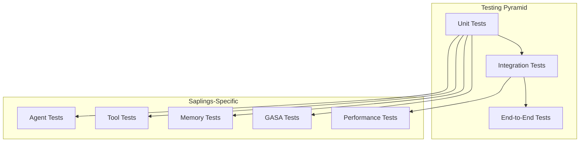

# Testing Guide

This guide covers comprehensive testing strategies for Saplings applications, including unit testing, integration testing, performance testing, and test automation.

## Table of Contents

- [Testing Philosophy](#testing-philosophy)
- [Test Setup & Configuration](#test-setup--configuration)
- [Unit Testing](#unit-testing)
- [Integration Testing](#integration-testing)
- [Performance Testing](#performance-testing)
- [Agent Testing](#agent-testing)
- [Tool Testing](#tool-testing)
- [Memory Testing](#memory-testing)
- [GASA Testing](#gasa-testing)
- [Test Automation](#test-automation)
- [Best Practices](#best-practices)

## Testing Philosophy

### Testing Pyramid for Saplings



### Testing Principles

1. **Test Early and Often**: Write tests before implementing features
2. **Isolation**: Tests should be independent and repeatable
3. **Comprehensive Coverage**: Test all critical paths and edge cases
4. **Performance Testing**: Ensure performance requirements are met
5. **Mock External Dependencies**: Use mocks for LLM API calls
6. **Real Integration Testing**: Test against real services when needed

## Test Setup & Configuration

### Installation

```bash
# Install Saplings with testing dependencies
pip install saplings[test]

# Or install specific testing tools
pip install pytest pytest-asyncio pytest-mock pytest-cov
```

### Test Configuration

```python
# conftest.py
import pytest
import asyncio
from unittest.mock import AsyncMock, MagicMock
from saplings import AgentBuilder
from saplings.testing import TestHelper, MockLLMProvider

@pytest.fixture
def event_loop():
    """Create an instance of the default event loop for the test session."""
    loop = asyncio.get_event_loop_policy().new_event_loop()
    yield loop
    loop.close()

@pytest.fixture
async def mock_agent():
    """Create a mock agent for testing."""
    agent = AgentBuilder.for_testing() \
        .with_mock_llm_provider() \
        .with_temp_memory() \
        .build()
    yield agent
    await agent.cleanup()

@pytest.fixture
def test_helper():
    """Create test helper instance."""
    return TestHelper()

@pytest.fixture
def mock_llm_provider():
    """Create mock LLM provider."""
    return MockLLMProvider()
```

### Test Environment Configuration

```python
# test_config.py
import os
from saplings.testing import TestConfig

# Configure test environment
TEST_CONFIG = TestConfig(
    use_mock_llm=True,
    temp_memory_dir=True,
    enable_tracing=False,
    log_level="WARNING",
    timeout=30,
)

# Set environment variables for testing
os.environ["SAPLINGS_ENV"] = "test"
os.environ["SAPLINGS_LOG_LEVEL"] = "WARNING"
os.environ["SAPLINGS_ENABLE_CACHE"] = "false"
```

## Unit Testing

### Basic Agent Testing

```python
# test_agent_basic.py
import pytest
from saplings import AgentBuilder
from saplings.testing import MockLLMProvider, TestAssertions

class TestAgentBasics:
    """Test basic agent functionality."""
    
    async def test_agent_creation(self):
        """Test agent can be created successfully."""
        agent = AgentBuilder.for_testing().build()
        assert agent is not None
        assert agent.provider_name == "mock"
    
    async def test_agent_run_simple(self, mock_agent):
        """Test simple agent execution."""
        # Configure mock response
        mock_agent.mock_provider.set_response("Hello, world!")
        
        result = await mock_agent.run("Say hello")
        
        assert result == "Hello, world!"
        assert mock_agent.mock_provider.call_count == 1
    
    async def test_agent_run_with_context(self, mock_agent):
        """Test agent execution with context."""
        mock_agent.mock_provider.set_response("Based on the context...")
        
        result = await mock_agent.run(
            "Answer this question",
            context="Relevant context information"
        )
        
        # Verify context was included in the prompt
        last_call = mock_agent.mock_provider.last_call
        assert "Relevant context information" in last_call.prompt
        assert result == "Based on the context..."
    
    async def test_agent_error_handling(self, mock_agent):
        """Test agent error handling."""
        mock_agent.mock_provider.set_error("API Error")
        
        with pytest.raises(Exception) as exc_info:
            await mock_agent.run("This will fail")
        
        assert "API Error" in str(exc_info.value)

class TestAgentConfiguration:
    """Test agent configuration."""
    
    def test_agent_builder_configuration(self):
        """Test agent builder with various configurations."""
        agent = AgentBuilder.for_testing() \
            .with_model("test-model") \
            .with_temperature(0.5) \
            .with_max_tokens(100) \
            .build()
        
        config = agent.get_configuration()
        assert config.model_name == "test-model"
        assert config.temperature == 0.5
        assert config.max_tokens == 100
    
    def test_agent_invalid_configuration(self):
        """Test agent creation with invalid configuration."""
        with pytest.raises(ValueError):
            AgentBuilder.for_testing() \
                .with_temperature(2.0) \  # Invalid temperature
                .build()
```

### Testing with Assertions

```python
# test_assertions.py
from saplings.testing import TestAssertions

class TestWithAssertions:
    """Test using built-in test assertions."""
    
    async def test_response_quality(self, mock_agent):
        """Test response quality assertions."""
        mock_agent.mock_provider.set_response(
            "Machine learning is a subset of artificial intelligence..."
        )
        
        result = await mock_agent.run("What is machine learning?")
        
        # Use built-in assertions
        assertions = TestAssertions()
        assertions.assert_response_length(result, min_length=10)
        assertions.assert_contains_keywords(result, ["machine learning", "artificial"])
        assertions.assert_no_errors(result)
        assertions.assert_coherent_response(result)
    
    async def test_performance_assertions(self, mock_agent):
        """Test performance-related assertions."""
        import time
        
        start_time = time.time()
        result = await mock_agent.run("Quick response needed")
        end_time = time.time()
        
        assertions = TestAssertions()
        assertions.assert_response_time(end_time - start_time, max_time=5.0)
        assertions.assert_response_not_empty(result)
```

## Integration Testing

### End-to-End Testing

```python
# test_e2e.py
import pytest
from saplings import AgentBuilder
from saplings.testing import IntegrationTestCase

class TestEndToEnd(IntegrationTestCase):
    """End-to-end integration tests."""
    
    @pytest.mark.integration
    async def test_complete_workflow(self):
        """Test complete agent workflow."""
        # Use real provider for integration tests
        agent = AgentBuilder.for_openai("gpt-3.5-turbo") \
            .with_api_key_from_env("OPENAI_API_KEY") \
            .with_temp_memory() \
            .build()
        
        # Add some documents
        agent.add_document("Machine learning is a method of data analysis.")
        agent.add_document("Deep learning uses neural networks.")
        
        # Test retrieval and generation
        result = await agent.run("What is machine learning?")
        
        # Assertions for real responses
        assert len(result) > 50  # Reasonable response length
        assert "machine learning" in result.lower()
        
        await agent.cleanup()
    
    @pytest.mark.integration
    async def test_tool_integration(self):
        """Test tool integration."""
        agent = AgentBuilder.for_openai("gpt-3.5-turbo") \
            .with_tools(["PythonInterpreterTool"]) \
            .build()
        
        result = await agent.run("Calculate 15 * 23")
        
        # Should use Python tool and get correct answer
        assert "345" in result
        
        await agent.cleanup()

class TestProviderIntegration:
    """Test integration with different providers."""
    
    @pytest.mark.integration
    @pytest.mark.parametrize("provider,model", [
        ("openai", "gpt-3.5-turbo"),
        ("anthropic", "claude-3-haiku"),
    ])
    async def test_provider_compatibility(self, provider, model):
        """Test compatibility across providers."""
        if provider == "openai":
            agent = AgentBuilder.for_openai(model).build()
        elif provider == "anthropic":
            agent = AgentBuilder.for_anthropic(model).build()
        
        result = await agent.run("What is 2+2?")
        
        assert "4" in result
        await agent.cleanup()
```

### Database Integration Testing

```python
# test_database_integration.py
import pytest
import tempfile
import shutil
from saplings import AgentBuilder

class TestDatabaseIntegration:
    """Test database and persistence integration."""
    
    @pytest.fixture
    def temp_memory_dir(self):
        """Create temporary memory directory."""
        temp_dir = tempfile.mkdtemp()
        yield temp_dir
        shutil.rmtree(temp_dir)
    
    async def test_memory_persistence(self, temp_memory_dir):
        """Test memory persistence across agent instances."""
        # Create agent with persistent memory
        agent1 = AgentBuilder.for_testing() \
            .with_memory_path(temp_memory_dir) \
            .build()
        
        # Add documents
        agent1.add_document("Test document 1", {"id": "doc1"})
        agent1.add_document("Test document 2", {"id": "doc2"})
        
        # Cleanup first agent
        await agent1.cleanup()
        
        # Create new agent with same memory path
        agent2 = AgentBuilder.for_testing() \
            .with_memory_path(temp_memory_dir) \
            .build()
        
        # Verify documents are still there
        docs = agent2.list_documents()
        assert len(docs) == 2
        
        doc_ids = [doc.metadata.get("id") for doc in docs]
        assert "doc1" in doc_ids
        assert "doc2" in doc_ids
        
        await agent2.cleanup()
```

## Performance Testing

### Load Testing

```python
# test_performance.py
import pytest
import asyncio
import time
from saplings.testing import PerformanceTester, LoadTester

class TestPerformance:
    """Performance and load testing."""
    
    @pytest.mark.performance
    async def test_response_time(self, mock_agent):
        """Test response time requirements."""
        mock_agent.mock_provider.set_response("Quick response")
        mock_agent.mock_provider.set_delay(0.1)  # 100ms delay
        
        start_time = time.time()
        result = await mock_agent.run("Fast query")
        end_time = time.time()
        
        assert end_time - start_time < 1.0  # Should respond within 1 second
        assert result == "Quick response"
    
    @pytest.mark.performance
    async def test_concurrent_requests(self, mock_agent):
        """Test concurrent request handling."""
        mock_agent.mock_provider.set_response("Concurrent response")
        
        # Create multiple concurrent requests
        tasks = []
        for i in range(10):
            task = mock_agent.run(f"Query {i}")
            tasks.append(task)
        
        start_time = time.time()
        results = await asyncio.gather(*tasks)
        end_time = time.time()
        
        # All requests should complete
        assert len(results) == 10
        assert all("Concurrent response" in result for result in results)
        
        # Should not take too long even with concurrent requests
        assert end_time - start_time < 5.0
    
    @pytest.mark.performance
    async def test_memory_usage(self, mock_agent):
        """Test memory usage with large datasets."""
        import psutil
        import os
        
        process = psutil.Process(os.getpid())
        initial_memory = process.memory_info().rss / 1024 / 1024  # MB
        
        # Add many documents
        for i in range(1000):
            mock_agent.add_document(f"Document {i} with some content", {"id": i})
        
        # Check memory usage
        current_memory = process.memory_info().rss / 1024 / 1024  # MB
        memory_increase = current_memory - initial_memory
        
        # Memory increase should be reasonable (less than 100MB for 1000 docs)
        assert memory_increase < 100
    
    @pytest.mark.performance
    async def test_gasa_performance(self):
        """Test GASA performance with different configurations."""
        performance_tester = PerformanceTester()
        
        # Test different GASA strategies
        strategies = ["sparse", "binary", "adaptive"]
        results = {}
        
        for strategy in strategies:
            agent = AgentBuilder.for_testing() \
                .with_gasa_enabled(True) \
                .with_gasa_strategy(strategy) \
                .build()
            
            # Measure performance
            result = await performance_tester.measure_execution_time(
                agent.run, "Analyze this complex document"
            )
            
            results[strategy] = result
            await agent.cleanup()
        
        # Sparse should be fastest
        assert results["sparse"]["duration"] <= results["binary"]["duration"]
        assert results["sparse"]["duration"] <= results["adaptive"]["duration"]

class TestLoadTesting:
    """Load testing for production scenarios."""
    
    @pytest.mark.load
    async def test_sustained_load(self, mock_agent):
        """Test agent under sustained load."""
        load_tester = LoadTester()
        
        async def test_function():
            return await mock_agent.run("Load test query")
        
        # Run load test
        results = await load_tester.run_load_test(
            test_function=test_function,
            concurrent_users=5,
            duration_seconds=30,
            requests_per_second=2
        )
        
        # Verify load test results
        assert results.total_requests > 250  # At least 250 requests in 30 seconds
        assert results.success_rate > 0.95   # 95% success rate
        assert results.average_response_time < 1.0  # Average response time < 1s
```

## Agent Testing

### Specialized Agent Testing

```python
# test_agent_specialized.py
import pytest
from saplings.testing import AgentTestCase, TestScenarios

class TestAgentBehavior(AgentTestCase):
    """Test specific agent behaviors."""
    
    async def test_context_retention(self, mock_agent):
        """Test agent retains context across multiple interactions."""
        mock_agent.mock_provider.set_responses([
            "I understand you're working on a project.",
            "Based on our previous discussion about your project..."
        ])
        
        # First interaction
        result1 = await mock_agent.run("I'm working on a machine learning project")
        
        # Second interaction - should reference previous context
        result2 = await mock_agent.run("What should I do next?")
        
        # Verify context retention
        assert "project" in result2.lower()
        assert mock_agent.mock_provider.call_count == 2
    
    async def test_error_recovery(self, mock_agent):
        """Test agent error recovery mechanisms."""
        # Configure mock to fail first, succeed second
        mock_agent.mock_provider.set_responses([
            Exception("Temporary failure"),
            "Successful response after retry"
        ])
        
        # Should retry and succeed
        result = await mock_agent.run("Task that fails initially")
        assert result == "Successful response after retry"
    
    async def test_tool_selection(self, mock_agent):
        """Test agent tool selection logic."""
        mock_agent.add_tool("CalculatorTool")
        mock_agent.add_tool("WebSearchTool")
        
        # Mock tool responses
        mock_agent.mock_tool_response("CalculatorTool", "42")
        mock_agent.mock_provider.set_response("The answer is 42")
        
        result = await mock_agent.run("What is 6 * 7?")
        
        # Verify correct tool was used
        assert mock_agent.was_tool_called("CalculatorTool")
        assert not mock_agent.was_tool_called("WebSearchTool")
        assert "42" in result

class TestAgentScenarios:
    """Test common agent usage scenarios."""
    
    @pytest.mark.parametrize("scenario", [
        "research_assistant",
        "code_reviewer",
        "data_analyst",
        "creative_writer"
    ])
    async def test_agent_scenarios(self, scenario, mock_agent):
        """Test agents in different scenarios."""
        test_scenarios = TestScenarios()
        
        # Configure agent for scenario
        config = test_scenarios.get_scenario_config(scenario)
        mock_agent.update_configuration(config)
        
        # Get test cases for scenario
        test_cases = test_scenarios.get_test_cases(scenario)
        
        for test_case in test_cases:
            mock_agent.mock_provider.set_response(test_case.expected_response)
            
            result = await mock_agent.run(test_case.input)
            
            # Verify response meets scenario requirements
            test_scenarios.assert_scenario_requirements(
                scenario, test_case.input, result
            )
```

## Tool Testing

### Tool Unit Testing

```python
# test_tools.py
import pytest
from saplings.tools import PythonInterpreterTool, WebSearchTool
from saplings.testing import ToolTestCase

class TestPythonInterpreterTool(ToolTestCase):
    """Test Python interpreter tool."""
    
    @pytest.fixture
    def python_tool(self):
        return PythonInterpreterTool()
    
    async def test_simple_calculation(self, python_tool):
        """Test simple Python calculation."""
        result = await python_tool.execute("print(2 + 3)")
        
        assert result.success
        assert "5" in result.output
        assert result.error is None
    
    async def test_variable_persistence(self, python_tool):
        """Test variable persistence across executions."""
        # Set a variable
        result1 = await python_tool.execute("x = 10")
        assert result1.success
        
        # Use the variable
        result2 = await python_tool.execute("print(x * 2)")
        assert result2.success
        assert "20" in result2.output
    
    async def test_error_handling(self, python_tool):
        """Test Python error handling."""
        result = await python_tool.execute("print(undefined_variable)")
        
        assert not result.success
        assert "NameError" in result.error
        assert result.output == ""
    
    async def test_security_restrictions(self, python_tool):
        """Test security restrictions."""
        # Should not be able to import restricted modules
        result = await python_tool.execute("import os; os.system('ls')")
        
        assert not result.success
        assert "restricted" in result.error.lower()

class TestCustomTool:
    """Test custom tool implementation."""
    
    def test_tool_registration(self):
        """Test custom tool can be registered."""
        from saplings.tools import register_tool
        
        @register_tool("custom_calculator")
        class CustomCalculatorTool:
            async def execute(self, expression: str):
                # Simple calculator implementation
                try:
                    result = eval(expression)
                    return {"success": True, "result": result}
                except Exception as e:
                    return {"success": False, "error": str(e)}
        
        # Verify tool is registered
        from saplings.tools import get_tool
        tool = get_tool("custom_calculator")
        assert tool is not None
        assert isinstance(tool, CustomCalculatorTool)
    
    async def test_tool_validation(self):
        """Test tool input validation."""
        from saplings.tools.validation import validate_tool_input
        
        # Valid input
        assert validate_tool_input("PythonInterpreterTool", "print('hello')")
        
        # Invalid input
        assert not validate_tool_input("PythonInterpreterTool", "")
        assert not validate_tool_input("PythonInterpreterTool", None)
```

## Memory Testing

### Memory System Testing

```python
# test_memory.py
import pytest
import tempfile
import shutil
from saplings.memory import MemoryManager
from saplings.testing import MemoryTestCase

class TestMemoryManager(MemoryTestCase):
    """Test memory management functionality."""
    
    @pytest.fixture
    def temp_memory_path(self):
        temp_dir = tempfile.mkdtemp()
        yield temp_dir
        shutil.rmtree(temp_dir)
    
    async def test_document_storage_retrieval(self, temp_memory_path):
        """Test basic document storage and retrieval."""
        memory = MemoryManager(memory_path=temp_memory_path)
        
        # Add documents
        doc_id1 = memory.add_document("First document content", {"type": "text"})
        doc_id2 = memory.add_document("Second document content", {"type": "text"})
        
        # Retrieve documents
        doc1 = memory.get_document(doc_id1)
        doc2 = memory.get_document(doc_id2)
        
        assert doc1.content == "First document content"
        assert doc2.content == "Second document content"
        assert doc1.metadata["type"] == "text"
    
    async def test_document_search(self, temp_memory_path):
        """Test document search functionality."""
        memory = MemoryManager(memory_path=temp_memory_path)
        
        # Add documents with different content
        memory.add_document("Machine learning algorithms", {"category": "AI"})
        memory.add_document("Deep learning neural networks", {"category": "AI"})
        memory.add_document("Web development frameworks", {"category": "Web"})
        
        # Search for AI-related documents
        results = memory.search("machine learning", max_results=10)
        
        assert len(results) >= 1
        assert any("machine learning" in result.content.lower() for result in results)
    
    async def test_metadata_filtering(self, temp_memory_path):
        """Test metadata-based filtering."""
        memory = MemoryManager(memory_path=temp_memory_path)
        
        # Add documents with metadata
        memory.add_document("Document 1", {"priority": "high", "author": "alice"})
        memory.add_document("Document 2", {"priority": "low", "author": "bob"})
        memory.add_document("Document 3", {"priority": "high", "author": "charlie"})
        
        # Filter by metadata
        high_priority = memory.filter_by_metadata({"priority": "high"})
        alice_docs = memory.filter_by_metadata({"author": "alice"})
        
        assert len(high_priority) == 2
        assert len(alice_docs) == 1
    
    async def test_memory_cleanup(self, temp_memory_path):
        """Test memory cleanup and optimization."""
        memory = MemoryManager(memory_path=temp_memory_path)
        
        # Add many documents
        for i in range(100):
            memory.add_document(f"Document {i}", {"index": i})
        
        # Remove some documents
        for i in range(0, 50, 2):  # Remove every other document
            documents = memory.filter_by_metadata({"index": i})
            if documents:
                memory.remove_document(documents[0].id)
        
        # Cleanup memory
        removed_count = memory.cleanup_orphaned_embeddings()
        
        assert removed_count > 0
        
        # Verify remaining documents
        remaining = memory.list_documents()
        assert len(remaining) == 75  # 50 removed + 25 remaining odd numbers

class TestMemoryPerformance:
    """Test memory system performance."""
    
    @pytest.mark.performance
    async def test_large_document_ingestion(self, temp_memory_path):
        """Test ingesting large number of documents."""
        memory = MemoryManager(memory_path=temp_memory_path)
        
        import time
        start_time = time.time()
        
        # Add 1000 documents
        for i in range(1000):
            memory.add_document(f"Document {i} with content", {"index": i})
        
        end_time = time.time()
        ingestion_time = end_time - start_time
        
        # Should ingest 1000 documents in reasonable time (< 30 seconds)
        assert ingestion_time < 30.0
        
        # Verify all documents were added
        all_docs = memory.list_documents()
        assert len(all_docs) == 1000
    
    @pytest.mark.performance
    async def test_search_performance(self, temp_memory_path):
        """Test search performance with large dataset."""
        memory = MemoryManager(memory_path=temp_memory_path)
        
        # Add documents
        for i in range(1000):
            content = f"Document {i} about {'machine learning' if i % 10 == 0 else 'other topics'}"
            memory.add_document(content, {"index": i})
        
        import time
        start_time = time.time()
        
        # Perform search
        results = memory.search("machine learning", max_results=20)
        
        end_time = time.time()
        search_time = end_time - start_time
        
        # Search should be fast (< 1 second)
        assert search_time < 1.0
        
        # Should find relevant documents
        assert len(results) > 0
        assert len(results) <= 20
```

## GASA Testing

### GASA Performance Testing

```python
# test_gasa.py
import pytest
import numpy as np
from saplings.gasa import GASAAttention, GASAConfig
from saplings.testing import GASATestCase

class TestGASAAttention(GASATestCase):
    """Test GASA attention mechanism."""
    
    @pytest.fixture
    def gasa_config(self):
        return GASAConfig(
            strategy="binary",
            max_hops=2,
            threshold=0.1,
            cache_enabled=True
        )
    
    async def test_attention_computation(self, gasa_config):
        """Test basic attention computation."""
        gasa = GASAAttention(gasa_config)
        
        # Create test input
        sequence_length = 100
        hidden_size = 64
        input_tensor = np.random.randn(sequence_length, hidden_size)
        
        # Compute attention
        attention_weights = gasa.compute_attention(input_tensor)
        
        # Verify attention weights
        assert attention_weights.shape == (sequence_length, sequence_length)
        assert np.allclose(attention_weights.sum(axis=1), 1.0)  # Should sum to 1
        assert np.all(attention_weights >= 0)  # Should be non-negative
    
    async def test_sparse_attention_patterns(self, gasa_config):
        """Test sparse attention pattern generation."""
        gasa = GASAAttention(gasa_config)
        
        sequence_length = 50
        
        # Test different sparsity patterns
        patterns = gasa.generate_sparse_patterns(sequence_length)
        
        # Verify sparsity
        total_elements = sequence_length * sequence_length
        non_zero_elements = np.count_nonzero(patterns)
        sparsity_ratio = non_zero_elements / total_elements
        
        assert sparsity_ratio < 0.5  # Should be sparse (< 50% non-zero)
        assert sparsity_ratio > 0.1  # But not too sparse (> 10% non-zero)
    
    @pytest.mark.parametrize("strategy", ["binary", "adaptive", "hierarchical", "sparse"])
    async def test_strategy_comparison(self, strategy):
        """Test different GASA strategies."""
        config = GASAConfig(strategy=strategy, max_hops=2)
        gasa = GASAAttention(config)
        
        sequence_length = 32
        hidden_size = 64
        input_tensor = np.random.randn(sequence_length, hidden_size)
        
        import time
        start_time = time.time()
        
        attention_weights = gasa.compute_attention(input_tensor)
        
        end_time = time.time()
        computation_time = end_time - start_time
        
        # Verify output shape and properties
        assert attention_weights.shape == (sequence_length, sequence_length)
        
        # Performance expectations based on strategy
        if strategy == "sparse":
            assert computation_time < 0.1  # Sparse should be fastest
        elif strategy == "binary":
            assert computation_time < 0.2  # Binary should be fast
        # Adaptive and hierarchical may take longer but should still be reasonable
        assert computation_time < 1.0

class TestGASAIntegration:
    """Test GASA integration with agents."""
    
    async def test_gasa_enabled_agent(self):
        """Test agent with GASA enabled."""
        from saplings import AgentBuilder
        
        agent = AgentBuilder.for_testing() \
            .with_gasa_enabled(True) \
            .with_gasa_strategy("binary") \
            .build()
        
        # Add documents to test attention
        for i in range(10):
            agent.add_document(f"Document {i} with relevant content")
        
        # Mock response that would use attention
        agent.mock_provider.set_response("Response using GASA attention")
        
        result = await agent.run("Find relevant information")
        
        # Verify GASA was used (would check internal metrics in real implementation)
        assert result == "Response using GASA attention"
        
        await agent.cleanup()
    
    async def test_gasa_fallback_mechanism(self):
        """Test GASA fallback when main strategy fails."""
        from saplings import AgentBuilder
        
        agent = AgentBuilder.for_testing() \
            .with_gasa_enabled(True) \
            .with_gasa_strategy("adaptive") \
            .with_gasa_fallback("binary") \
            .build()
        
        # Test with challenging input that might trigger fallback
        large_content = "Large content " * 1000  # Very large document
        agent.add_document(large_content)
        
        agent.mock_provider.set_response("Fallback response")
        
        result = await agent.run("Process this large content")
        
        assert result == "Fallback response"
        
        await agent.cleanup()
```

## Test Automation

### Continuous Integration Testing

```yaml
# .github/workflows/test.yml
name: Test Suite

on:
  push:
    branches: [ main, develop ]
  pull_request:
    branches: [ main ]

jobs:
  test:
    runs-on: ubuntu-latest
    strategy:
      matrix:
        python-version: [3.8, 3.9, 3.10, 3.11]
    
    steps:
    - uses: actions/checkout@v3
    
    - name: Set up Python ${{ matrix.python-version }}
      uses: actions/setup-python@v3
      with:
        python-version: ${{ matrix.python-version }}
    
    - name: Install dependencies
      run: |
        python -m pip install --upgrade pip
        pip install -e .[test]
    
    - name: Run unit tests
      run: |
        pytest tests/unit/ -v --cov=saplings --cov-report=xml
    
    - name: Run integration tests
      run: |
        pytest tests/integration/ -v -m "not slow"
      env:
        OPENAI_API_KEY: ${{ secrets.OPENAI_API_KEY }}
    
    - name: Upload coverage to Codecov
      uses: codecov/codecov-action@v3
      with:
        file: ./coverage.xml
        flags: unittests
        name: codecov-umbrella
```

### Test Configuration Management

```python
# test_runner.py
import pytest
import sys
import os
from pathlib import Path

class TestRunner:
    """Automated test runner with different configurations."""
    
    def __init__(self):
        self.test_root = Path(__file__).parent
        self.config_dir = self.test_root / "configs"
    
    def run_unit_tests(self):
        """Run unit tests only."""
        return pytest.main([
            str(self.test_root / "unit"),
            "-v",
            "--cov=saplings",
            "--cov-report=html",
            "--cov-report=term"
        ])
    
    def run_integration_tests(self):
        """Run integration tests."""
        return pytest.main([
            str(self.test_root / "integration"),
            "-v",
            "-m", "integration"
        ])
    
    def run_performance_tests(self):
        """Run performance tests."""
        return pytest.main([
            str(self.test_root / "performance"),
            "-v",
            "-m", "performance",
            "--tb=short"
        ])
    
    def run_all_tests(self):
        """Run all test suites."""
        test_suites = [
            ("Unit Tests", self.run_unit_tests),
            ("Integration Tests", self.run_integration_tests),
            ("Performance Tests", self.run_performance_tests),
        ]
        
        results = {}
        for suite_name, test_func in test_suites:
            print(f"\n{'='*50}")
            print(f"Running {suite_name}")
            print(f"{'='*50}")
            
            result = test_func()
            results[suite_name] = result
        
        return results

if __name__ == "__main__":
    runner = TestRunner()
    
    if len(sys.argv) > 1:
        suite = sys.argv[1].lower()
        if suite == "unit":
            sys.exit(runner.run_unit_tests())
        elif suite == "integration":
            sys.exit(runner.run_integration_tests())
        elif suite == "performance":
            sys.exit(runner.run_performance_tests())
        else:
            print(f"Unknown test suite: {suite}")
            sys.exit(1)
    else:
        results = runner.run_all_tests()
        
        # Print summary
        print(f"\n{'='*50}")
        print("Test Summary")
        print(f"{'='*50}")
        
        all_passed = True
        for suite_name, result in results.items():
            status = "PASSED" if result == 0 else "FAILED"
            print(f"{suite_name}: {status}")
            if result != 0:
                all_passed = False
        
        sys.exit(0 if all_passed else 1)
```

## Best Practices

### Test Organization

```python
# test_best_practices.py
"""
Test organization best practices for Saplings.

Directory Structure:
tests/
├── unit/
│   ├── test_agent.py
│   ├── test_tools.py
│   ├── test_memory.py
│   └── test_gasa.py
├── integration/
│   ├── test_e2e.py
│   ├── test_providers.py
│   └── test_workflows.py
├── performance/
│   ├── test_load.py
│   ├── test_memory_usage.py
│   └── test_gasa_performance.py
├── fixtures/
│   ├── conftest.py
│   ├── sample_documents/
│   └── test_data.json
└── utils/
    ├── test_helpers.py
    └── mock_providers.py
"""

class TestBestPractices:
    """Demonstrate testing best practices."""
    
    # 1. Use descriptive test names
    async def test_agent_should_retry_failed_requests_with_exponential_backoff(self):
        """Test names should describe the expected behavior clearly."""
        pass
    
    # 2. Follow AAA pattern (Arrange, Act, Assert)
    async def test_document_retrieval_with_metadata_filtering(self, mock_agent):
        # Arrange
        mock_agent.add_document("Doc 1", {"type": "report", "year": 2023})
        mock_agent.add_document("Doc 2", {"type": "note", "year": 2023})
        mock_agent.add_document("Doc 3", {"type": "report", "year": 2024})
        
        # Act
        reports_2023 = mock_agent.search_documents(
            query="*",
            metadata_filter={"type": "report", "year": 2023}
        )
        
        # Assert
        assert len(reports_2023) == 1
        assert reports_2023[0].metadata["type"] == "report"
        assert reports_2023[0].metadata["year"] == 2023
    
    # 3. Test edge cases and error conditions
    async def test_agent_handles_empty_response_gracefully(self, mock_agent):
        """Test edge case where LLM returns empty response."""
        mock_agent.mock_provider.set_response("")
        
        result = await mock_agent.run("Some query")
        
        # Should handle empty response appropriately
        assert result is not None
        assert isinstance(result, str)
    
    # 4. Use parametrized tests for similar test cases
    @pytest.mark.parametrize("temperature,expected_randomness", [
        (0.0, "low"),
        (0.5, "medium"),
        (1.0, "high"),
    ])
    async def test_temperature_affects_response_randomness(
        self, mock_agent, temperature, expected_randomness
    ):
        """Test that temperature parameter affects response randomness."""
        mock_agent.set_temperature(temperature)
        
        # Mock appropriate response based on temperature
        if expected_randomness == "low":
            mock_agent.mock_provider.set_response("Consistent response")
        elif expected_randomness == "medium":
            mock_agent.mock_provider.set_response("Somewhat varied response")
        else:
            mock_agent.mock_provider.set_response("Very creative response")
        
        result = await mock_agent.run("Generate text")
        
        # Verify response matches expected randomness level
        assert expected_randomness in result.lower()
    
    # 5. Clean up resources in tests
    async def test_agent_cleanup_releases_resources(self):
        """Test that agent cleanup properly releases resources."""
        agent = AgentBuilder.for_testing().build()
        
        # Use agent
        await agent.run("Test query")
        
        # Cleanup
        await agent.cleanup()
        
        # Verify cleanup
        assert agent.is_cleaned_up()
        
        # Attempting to use cleaned up agent should raise error
        with pytest.raises(RuntimeError):
            await agent.run("This should fail")
```

### Testing Utilities

```python
# test_utilities.py
from saplings.testing import TestUtilities

class TestUtilities:
    """Utility functions for testing."""
    
    @staticmethod
    def create_test_documents(count: int = 10):
        """Create test documents for testing."""
        documents = []
        for i in range(count):
            documents.append({
                "content": f"Test document {i} with unique content",
                "metadata": {
                    "id": f"doc_{i}",
                    "type": "test",
                    "index": i,
                    "category": "A" if i % 2 == 0 else "B"
                }
            })
        return documents
    
    @staticmethod
    def assert_response_quality(response: str, min_words: int = 5):
        """Assert response meets quality criteria."""
        words = response.split()
        assert len(words) >= min_words, f"Response too short: {len(words)} words"
        assert response.strip(), "Response is empty or whitespace"
        assert not response.lower().startswith("error"), "Response indicates error"
    
    @staticmethod
    def create_performance_baseline():
        """Create performance baseline for comparison."""
        return {
            "response_time": 2.0,      # seconds
            "memory_usage": 100,       # MB
            "throughput": 10,          # requests/second
            "error_rate": 0.01,        # 1%
        }

# Example test using utilities
class TestWithUtilities:
    
    async def test_batch_document_processing(self, mock_agent):
        """Test processing multiple documents efficiently."""
        # Create test data
        documents = TestUtilities.create_test_documents(50)
        
        # Add documents to agent
        for doc in documents:
            mock_agent.add_document(doc["content"], doc["metadata"])
        
        # Mock batch processing response
        mock_agent.mock_provider.set_response("Processed 50 documents successfully")
        
        # Process documents
        result = await mock_agent.run("Process all documents")
        
        # Verify response quality
        TestUtilities.assert_response_quality(result, min_words=3)
        assert "50" in result
        assert "processed" in result.lower()
```

This comprehensive testing guide provides users with all the tools and knowledge needed to thoroughly test Saplings applications across all levels, from unit tests to performance testing.